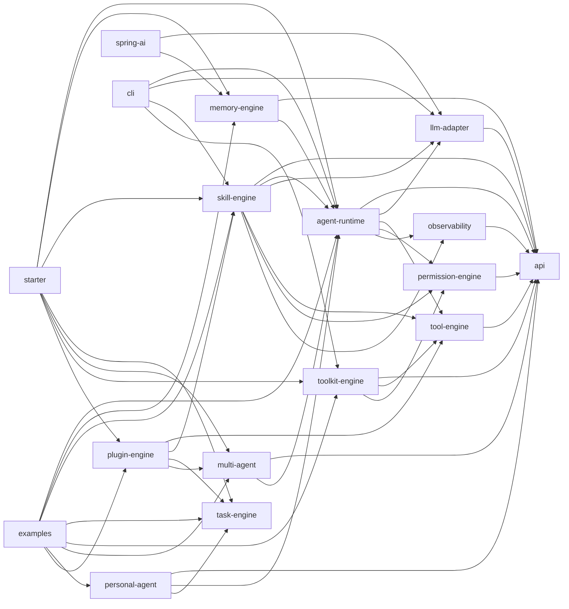
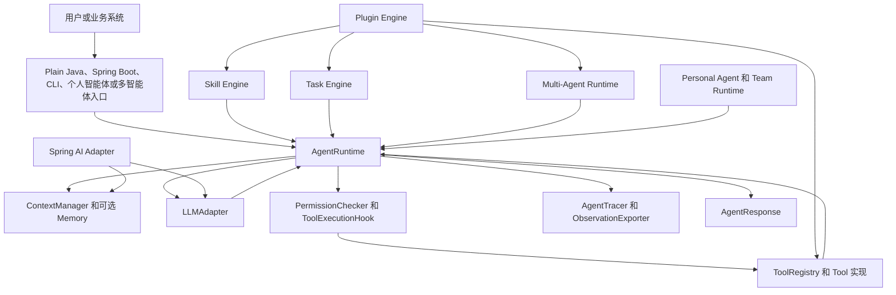

# OpenHarness4j

**语言:** [English](README.md) | 简体中文

OpenHarness4j 是一个面向 Java 的 Agent Harness 运行时，用于构建可控、可观测、可调用工具的智能体，并可以嵌入到业务系统中。

它提供了 Java 应用把 LLM 从“生成文本”升级为“可控执行”时通常需要的基础能力：Agent Loop、LLM 适配器、工具注册、权限检查、记忆、技能、异步任务、多智能体编排、个人/团队智能体、插件、CLI 验证和 Spring Boot 自动配置。

## 当前状态

当前版本：`1.5.0-SNAPSHOT`

当前版本包含：

| 能力 | 状态 |
| --- | --- |
| 可嵌入的 Java `AgentRuntime` | 已提供 |
| Mock、Fallback 和 OpenAI-compatible LLM 适配器 | 已提供 |
| 工具注册表与结构化工具执行 | 已提供 |
| 受治理的 File、Shell、Web Fetch、Search、MCP Client 工具 | 已提供 |
| 路径、命令、工具和审批治理 | 已提供 |
| Runtime 事件、重试策略、并行工具和成本追踪 | 已提供 |
| Memory Store、会话管理和上下文文件 | 已提供 |
| YAML 和 Markdown Skills | 已提供 |
| 异步任务引擎 | 已提供 |
| 多智能体规划、执行、聚合和冲突检测 | 已提供 |
| 个人智能体通道和长期团队运行时 | 已提供 |
| 插件描述符、激活生命周期和贡献上下文 | 已提供 |
| Provider Profile 与 Fallback 适配器选择 | 已提供 |
| CLI prompt、interactive、JSON、stream-json 和 dry-run 检查 | 已提供 |
| Spring Boot 自动配置 | 已提供 |
| Spring AI `ChatModel` 和 `VectorStore` 适配 | 已提供 |

更多产品和使用说明见 [docs/usage.md](docs/usage.md)、[docs/cli.md](docs/cli.md)、[docs/openharness-comparison.md](docs/openharness-comparison.md) 和 [产品文档.md](产品文档.md)。

## 工程结构

```text
OpenHarness4j
├── api                 # 共享公开契约和 record
├── llm-adapter         # LLM 适配器、Provider Profile、Fallback 选择
├── tool-engine         # Tool 接口和工具注册表
├── toolkit-engine      # 标准受治理工具
├── permission-engine   # 权限策略、审批 Hook、审计事件
├── observability       # Agent Trace 和观测导出
├── agent-runtime       # 默认 Agent Loop 和运行时配置
├── memory-engine       # 跨请求记忆、存储、上下文文件
├── skill-engine        # Java/YAML/Markdown Skill 和执行器
├── task-engine         # 进程内异步任务执行
├── multi-agent         # 规划和子智能体编排
├── personal-agent      # 面向通道的个人智能体和团队运行时
├── plugin-engine       # 插件描述符和贡献生命周期
├── starter             # Spring Boot 自动配置
├── spring-ai           # Spring AI ChatModel 和 VectorStore 适配
├── cli                 # 本地命令行入口
├── examples            # 可运行示例和功能验证
├── docs                # 扩展英文和中文指南
├── 产品文档.md          # 产品需求和路线图上下文
└── pom.xml             # Maven 多模块父工程
```

## 模块使用说明

| 模块目录 | Maven artifact | 适用场景 | 主要入口 | 是否必需 |
| --- | --- | --- | --- | --- |
| `api` | `openharness-api` | 需要共享请求、响应、消息、工具、用量和成本契约。 | `AgentRequest`、`AgentResponse`、`Message`、`ToolDefinition`、`ToolCall`、`ToolResult` | 基础 |
| `llm-adapter` | `openharness-llm-adapter` | 需要把 Runtime 接到模型供应商或测试实现。 | `LLMAdapter`、`OpenAICompatibleLLMAdapter`、`MockLLMAdapter`、`FallbackLLMAdapter`、`LLMProviderProfile` | 核心 |
| `tool-engine` | `openharness-tool-engine` | 需要注册业务工具。 | `Tool`、`ToolRegistry`、`InMemoryToolRegistry` | 核心 |
| `permission-engine` | `openharness-permission-engine` | 需要工具执行治理和审计。 | `PermissionChecker`、`PermissionPolicy`、`PolicyPermissionChecker`、`ToolExecutionHook`、`ApprovalRequiredToolHook` | 核心 |
| `observability` | `openharness-observability` | 需要运行时 Trace 和观测导出。 | `AgentTracer`、`DefaultAgentTracer`、`ExportingAgentTracer`、`ObservationExporter` | 核心 |
| `agent-runtime` | `openharness-agent-runtime` | 需要可嵌入的 Agent Loop。 | `AgentRuntime`、`DefaultAgentRuntime`、`AgentRuntimeConfig`、`RetryPolicy`、`TokenPricingCostEstimator` | 核心 |
| `toolkit-engine` | `openharness-toolkit-engine` | 需要内置的受治理工具。 | `StandardToolkit`、`FileTool`、`ShellTool`、`WebFetchTool`、`SearchTool`、`McpClientTool` | 可选 |
| `memory-engine` | `openharness-memory-engine` | 需要跨请求历史、记忆存储或上下文文件。 | `MemoryContextManager`、`MemorySessionManager`、`MemoryStore`、`ContextFileContextManager` | 可选 |
| `skill-engine` | `openharness-skill-engine` | 需要从 Java、YAML 或 Markdown 加载 Prompt/Workflow Skill。 | `SkillDefinition`、`SkillExecutor`、`DefaultSkillExecutor`、`YamlSkillLoader`、`MarkdownSkillLoader` | 可选 |
| `task-engine` | `openharness-task-engine` | 需要异步任务提交、状态查询、取消和超时。 | `TaskEngine`、`InMemoryTaskEngine`、`TaskHandler`、`TaskRequest` | 可选 |
| `multi-agent` | `openharness-multi-agent` | 需要规划、子智能体执行和结果聚合。 | `MultiAgentRuntime`、`DefaultMultiAgentRuntime`、`PlanningAgent`、`SubAgentRegistry` | 可选 |
| `personal-agent` | `openharness-personal-agent` | 需要面向 IM/通道的助手或长期团队智能体。 | `DefaultPersonalAgentService`、`PersonalAgentChannelAdapter`、`InMemoryTeamRuntime` | 可选 |
| `plugin-engine` | `openharness-plugin-engine` | 需要插件贡献工具、技能、任务或子智能体。 | `OpenHarnessPlugin`、`PluginDescriptor`、`PluginManager`、`PluginContext` | 可选 |
| `starter` | `openharness-spring-boot-starter` | 需要 Spring Boot Bean 和配置属性。 | `OpenHarnessAutoConfiguration`、`OpenHarnessProperties` | 可选 |
| `spring-ai` | `openharness-spring-ai` | 需要复用 Spring AI `ChatModel` 或 `VectorStore` 作为 OpenHarness 组件。 | `SpringAiModelDriver`、`SpringAiVectorStore`、`SpringAiOpenHarnessAutoConfiguration` | 可选 |
| `cli` | `openharness-cli` | 需要本地 prompt、interactive、JSON、stream-json 或 dry-run 检查。 | `OpenHarnessCli`、`CliOptions`、`CliDryRun` | 可选 |
| `examples` | `openharness-examples` | 需要可运行示例和发布验证。 | `SimpleAgentExample`、`FeatureVerificationExample`、`OpenHarnessFeatureVerifier` | 开发 |

## 模块关系图

箭头从模块指向它的直接 Maven 依赖。



## 运行链路图



## 快速开始

### Plain Java Runtime

添加核心 Runtime 依赖：

```xml
<dependency>
    <groupId>io.openharness4j</groupId>
    <artifactId>openharness-agent-runtime</artifactId>
    <version>1.5.0-SNAPSHOT</version>
</dependency>
```

创建 Runtime 时需要 LLM 适配器、工具注册表、权限检查器、Tracer 和上下文管理器：

```java
InMemoryToolRegistry tools = new InMemoryToolRegistry();
tools.register(new MyBusinessTool());

LLMAdapter llm = new OpenAICompatibleLLMAdapter(
        "https://api.openai.com/v1/chat/completions",
        System.getenv("OPENAI_API_KEY"),
        System.getenv("OPENAI_MODEL")
);

PermissionAuditStore auditStore = new InMemoryPermissionAuditStore();
PermissionChecker permissions = new AuditingPermissionChecker(
        new PolicyPermissionChecker(PermissionPolicy.allowByDefault(List.of())),
        auditStore
);

AgentRuntimeConfig config = AgentRuntimeConfig.defaults()
        .withLlmRetryPolicy(RetryPolicy.fixedDelay(2, 100))
        .withToolRetryPolicy(RetryPolicy.fixedDelay(2, 100))
        .withParallelToolExecution(true);

AgentRuntime runtime = new DefaultAgentRuntime(
        llm,
        tools,
        permissions,
        new ExportingAgentTracer(new InMemoryObservationExporter()),
        new DefaultContextManager(),
        config
);

AgentResponse response = runtime.run(
        AgentRequest.of("session-1", "user-1", "summarize today's work")
);
```

使用 `runtime.run(request, eventSink)` 可以消费 LLM 尝试、重试、文本增量、工具生命周期、成本更新和完成事件。

### 标准 Toolkit 与治理

需要内置 File、Shell、Web Fetch、Search 或 MCP Client 工具时，引入 `openharness-toolkit-engine`。

```java
Path workspace = Path.of("/srv/agent-workspace");

PathAccessPolicy pathPolicy = PathAccessPolicy.denyByDefault(List.of(
        PathAccessRule.allow(workspace, EnumSet.allOf(PathAccessMode.class)),
        PathAccessRule.deny(
                workspace.resolve("secrets"),
                EnumSet.allOf(PathAccessMode.class),
                RiskLevel.HIGH,
                "secret path denied"
        )
));

CommandPermissionPolicy commandPolicy = CommandPermissionPolicy.denyByDefault(List.of(
        CommandPermissionRule.allowPrefix("printf "),
        CommandPermissionRule.denyContains("rm -rf", RiskLevel.HIGH, "destructive command")
));

InMemoryToolRegistry tools = new InMemoryToolRegistry();
tools.register(new FileTool(workspace, pathPolicy));
tools.register(new ShellTool(workspace, commandPolicy));
tools.register(new SearchTool(searchProvider));
tools.register(new McpClientTool(mcpClient));
```

如果需要交互式治理，可以把 `ApprovalRequiredToolHook` 组合进 `DefaultAgentRuntime`，也可以在 Spring Boot 中暴露 `ToolExecutionHook` Bean。

### Memory 与上下文文件

使用 `openharness-memory-engine` 支持跨请求上下文和项目记忆。

```java
MemoryStore memoryStore = new InMemoryMemoryStore();
ContextManager context = new ContextFileContextManager(
        new MemoryContextManager(
                memoryStore,
                new MemoryWindowPolicy(20, true, new SimpleMemorySummarizer())
        ),
        Path.of("."),
        true,
        true,
        true,
        new SimpleMemorySummarizer()
);

MemorySessionManager sessions = new MemorySessionManager(memoryStore);
List<Message> history = sessions.resume("session-1");
```

`ContextFileContextManager` 可以把 `CLAUDE.md` 作为项目指令加载，把 `MEMORY.md` 作为持久记忆加载。

### Markdown Skills

使用 `openharness-skill-engine` 维护可复用的 Prompt 和 Workflow 定义。

```markdown
---
name: Incident Summary
description: Summarize an incident timeline.
---
Summarize the following incident notes and call out unresolved risks:

{{notes}}
```

```java
SkillDefinition skill = new MarkdownSkillLoader().load(Path.of("skills/incident/SKILL.md"));
InMemorySkillRegistry skills = new InMemorySkillRegistry();
skills.register(skill);
```

### Personal Agent 与 Team Runtime

使用 `openharness-personal-agent` 构建面向通道的助手和长期团队智能体。

```xml
<dependency>
    <groupId>io.openharness4j</groupId>
    <artifactId>openharness-personal-agent</artifactId>
    <version>1.5.0-SNAPSHOT</version>
</dependency>
```

```java
try (DefaultPersonalAgentService personalAgent = new DefaultPersonalAgentService(runtime)) {
    PersonalAgentMessage message = new SlackChannelAdapter().toMessage(Map.of(
            "channel_id", "C123",
            "user_id", "U123",
            "text", "prepare weekly brief"
    ));

    PersonalAgentSubmission submission = personalAgent.submit(message);
    PersonalAgentTaskSnapshot snapshot = personalAgent.get(submission.taskId()).orElseThrow();
}

InMemoryTeamAgentRegistry teamRegistry = new InMemoryTeamAgentRegistry();
teamRegistry.register(new TeamAgentDefinition("researcher", "Research", researcherRuntime));

try (InMemoryTeamRuntime teamRuntime = new InMemoryTeamRuntime(teamRegistry)) {
    TeamAgentSubmission spawned = teamRuntime.spawn(TeamAgentRequest.of(
            "researcher",
            "session-1",
            "user-1",
            "collect facts"
    ));
    TeamAgentSnapshot result = teamRuntime.get(spawned.taskId()).orElseThrow();
    TeamAgentArchive archive = teamRuntime.archive(spawned.taskId()).orElseThrow();
}
```

## Spring Boot Starter

添加 Starter：

```xml
<dependency>
    <groupId>io.openharness4j</groupId>
    <artifactId>openharness-spring-boot-starter</artifactId>
    <version>1.5.0-SNAPSHOT</version>
</dependency>
```

提供一个 `LLMAdapter` Bean，或者启用 Provider Profile；随后可以按需注册工具、技能、任务、子智能体或插件。

```java
@Bean
LLMAdapter llmAdapter() {
    return new OpenAICompatibleLLMAdapter(
            "http://localhost:11434/v1/chat/completions",
            null,
            "llama3.1"
    );
}

@Bean
Tool echoTool() {
    return new EchoTool();
}
```

配置示例：

```yaml
openharness:
  agent:
    max-iterations: 8
    parallel-tool-execution: true
    llm-retry-max-attempts: 2
    llm-retry-backoff-millis: 100
    tool-retry-max-attempts: 2
    tool-retry-backoff-millis: 100
  permission:
    default-allow: true
    denied-tools:
      - shell
  toolkit:
    base-directory: /srv/agent-workspace
    file:
      enabled: true
      allowed-paths:
        - .
      denied-paths:
        - secrets
    shell:
      enabled: true
      allowed-prefixes:
        - "printf "
      denied-contains:
        - "rm -rf"
      default-timeout-millis: 10000
    web-fetch:
      enabled: true
    search:
      enabled: true
    mcp:
      enabled: true
  memory:
    enabled: true
    max-messages: 20
    summarize-overflow: true
    retrieval:
      enabled: true
      namespace: openharness
      top-k: 5
      similarity-threshold: 0.0
      index-completed-messages: false
    context-files:
      enabled: true
      base-directory: .
      load-claude: true
      load-memory: true
      persist-memory: true
  skill:
    enabled: true
    markdown-locations:
      - classpath*:openharness/skills/*.md
      - classpath*:openharness/skills/*/SKILL.md
  task:
    enabled: true
    default-timeout-millis: 30000
    pool-size: 4
  multi-agent:
    enabled: true
  plugin:
    enabled: true
  provider:
    enabled: true
    default-profile: openai
    fallback-order:
      - openai
      - local
    profiles:
      - name: openai
        endpoint: https://api.openai.com/v1/chat/completions
        api-key-env: OPENAI_API_KEY
        model-env: OPENAI_MODEL
      - name: local
        endpoint: http://localhost:11434/v1/chat/completions
        model: llama3.1
```

## Spring AI 集成

如果 Spring Boot 应用已经通过 `spring.ai.*` 配置和 Spring AI provider starter 管理模型、API Key、向量库地址，可以引入 `openharness-spring-ai`。

```xml
<dependency>
    <groupId>io.openharness4j</groupId>
    <artifactId>openharness-spring-ai</artifactId>
    <version>1.5.0-SNAPSHOT</version>
</dependency>
```

适配模块会贡献：

| Spring AI Bean | OpenHarness4j Bean | 行为 |
| --- | --- | --- |
| `ChatModel` | 作为 `LLMAdapter` 的 `SpringAiModelDriver` | 把 Spring AI Chat 响应转换为 `LLMResponse`，工具执行仍由 OpenHarness 控制。 |
| `VectorStore` | 作为 `MemoryRetriever` 的 `SpringAiVectorStore` | 为 `RetrievalAugmentedContextManager` 提供 RAG 和语义记忆检索。 |

工具执行仍由 OpenHarness4j 控制。`SpringAiModelDriver` 会把 Spring AI Tool Calling 设置为用户控制模式，因此 `ToolRegistry`、权限检查、审计、重试和 Trace 仍走 OpenHarness4j 的治理链路。

应用配置示例：

```yaml
spring:
  ai:
    openai:
      api-key: ${OPENAI_API_KEY}
      chat:
        options:
          model: gpt-4.1-mini
    vectorstore:
      redis:
        uri: redis://localhost:6379

openharness:
  spring-ai:
    model:
      enabled: true
    vector:
      enabled: true
      namespace: openharness
  memory:
    retrieval:
      enabled: true
      top-k: 5
      similarity-threshold: 0.0
      index-completed-messages: true
```

## CLI

Prompt 模式：

```bash
mvn -q -pl cli -am exec:java -Dexec.args="-p hello --mock-response 'cli ok'"
```

Stream JSON 输出：

```bash
mvn -q -pl cli -am exec:java -Dexec.args="-p hello --mock-response 'stream ok' --output stream-json"
```

交互模式：

```bash
mvn -q -pl cli -am exec:java -Dexec.args="--interactive --mock-response 'interactive ok'"
```

Dry-run 就绪检查：

```bash
mvn -q -pl cli -am exec:java -Dexec.args="--dry-run --mock-response ready --enable-tool echo --tool echo --output json"
```

## 验证方式

运行完整测试：

```bash
mvn test
```

只运行 Spring AI 适配层测试：

```bash
mvn -pl spring-ai -am test
```

运行 v1.5 功能验证示例：

```bash
mvn -q -pl examples -am package exec:java
```

运行最小 echo 示例：

```bash
mvn -pl examples -am package exec:java -Dexec.mainClass=io.openharness4j.examples.SimpleAgentExample
```

功能验证示例覆盖纯文本响应、工具调用、权限拒绝、缺失工具、非法参数、工具失败、空 LLM 响应、用量聚合、Runtime 事件、重试、并行工具、成本追踪、Toolkit 治理、Memory、上下文文件、Skills、Tasks、多智能体执行、个人/团队智能体、插件、Provider Fallback、观测导出、CLI 模式和 dry-run 就绪检查。

## 兼容性

OpenHarness4j 在 `1.5.x` snapshot 线内保持公开契约的源码兼容，除非明确记录破坏性变更。生产集成应优先依赖公开接口和 record，避免依赖内部实现类。
