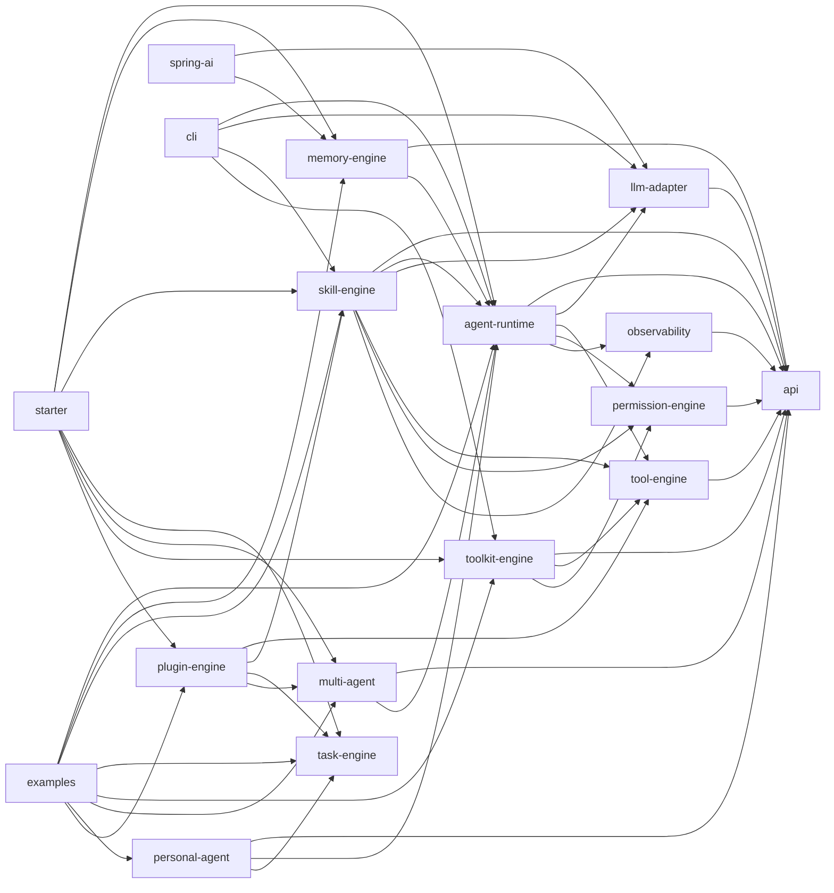
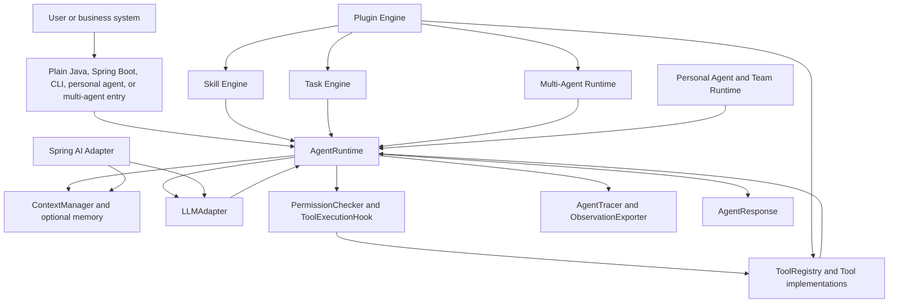

# OpenHarness4j

**Language:** English | [简体中文](README.cn.md)

OpenHarness4j is a Java Agent Harness runtime for building controlled, observable, tool-calling agents that can be embedded in business systems.

It provides the reusable runtime pieces that Java applications usually need when turning an LLM from "text generation" into "controlled execution": an agent loop, LLM adapters, tool registration, permission checks, memory, skills, async tasks, multi-agent orchestration, personal/team agents, plugins, CLI verification, and Spring Boot auto-configuration.

## Status

Current version: `1.5.0-SNAPSHOT`

The current line includes:

| Capability | Status |
| --- | --- |
| Embeddable Java `AgentRuntime` | Available |
| Mock, fallback, and OpenAI-compatible LLM adapters | Available |
| Tool registry and structured tool execution | Available |
| Governed File, Shell, Web Fetch, Search, and MCP Client tools | Available |
| Path, command, tool, and approval governance | Available |
| Runtime events, retry policies, parallel tools, and cost tracking | Available |
| Memory stores, session management, and context files | Available |
| YAML and Markdown skills | Available |
| Async task engine | Available |
| Multi-agent planning, execution, aggregation, and conflict detection | Available |
| Personal agent channels and long-lived team runtime | Available |
| Plugin descriptors, activation lifecycle, and contribution context | Available |
| Provider profiles and fallback adapter selection | Available |
| CLI prompt, interactive, JSON, stream-json, and dry-run checks | Available |
| Spring Boot auto-configuration | Available |
| Spring AI `ChatModel` and `VectorStore` adapters | Available |

See [docs/usage.md](docs/usage.md), [docs/cli.md](docs/cli.md), [docs/openharness-comparison.md](docs/openharness-comparison.md), and [产品文档.md](产品文档.md) for deeper product and usage notes.

## Project Structure

```text
OpenHarness4j
├── api                 # Shared public contracts and records
├── llm-adapter         # LLM adapters, provider profiles, fallback selection
├── tool-engine         # Tool interface and registry
├── toolkit-engine      # Standard governed tools
├── permission-engine   # Permission policies, approval hooks, audit events
├── observability       # Agent traces and observation exporters
├── agent-runtime       # Default agent loop and runtime configuration
├── memory-engine       # Cross-request memory, stores, context files
├── skill-engine        # Java/YAML/Markdown skills and executor
├── task-engine         # In-process async task execution
├── multi-agent         # Planning and sub-agent orchestration
├── personal-agent      # Channel-facing personal agents and team runtime
├── plugin-engine       # Plugin descriptors and contribution lifecycle
├── starter             # Spring Boot auto-configuration
├── spring-ai           # Spring AI ChatModel and VectorStore adapters
├── cli                 # Local command-line entry point
├── examples            # Runnable examples and feature verification
├── docs                # Extended English and Chinese guides
├── 产品文档.md          # Product requirements and roadmap context
└── pom.xml             # Maven multi-module parent
```

## Module Usage

| Module directory | Maven artifact | Use when | Main entry points | Required? |
| --- | --- | --- | --- | --- |
| `api` | `openharness-api` | You need shared request, response, message, tool, usage, and cost contracts. | `AgentRequest`, `AgentResponse`, `Message`, `ToolDefinition`, `ToolCall`, `ToolResult` | Foundation |
| `llm-adapter` | `openharness-llm-adapter` | You need to connect the runtime to model providers or tests. | `LLMAdapter`, `OpenAICompatibleLLMAdapter`, `MockLLMAdapter`, `FallbackLLMAdapter`, `LLMProviderProfile` | Core |
| `tool-engine` | `openharness-tool-engine` | You need to register business tools. | `Tool`, `ToolRegistry`, `InMemoryToolRegistry` | Core |
| `permission-engine` | `openharness-permission-engine` | You need tool execution governance and audit. | `PermissionChecker`, `PermissionPolicy`, `PolicyPermissionChecker`, `ToolExecutionHook`, `ApprovalRequiredToolHook` | Core |
| `observability` | `openharness-observability` | You need runtime traces and observation export. | `AgentTracer`, `DefaultAgentTracer`, `ExportingAgentTracer`, `ObservationExporter` | Core |
| `agent-runtime` | `openharness-agent-runtime` | You need the embeddable agent loop. | `AgentRuntime`, `DefaultAgentRuntime`, `AgentRuntimeConfig`, `RetryPolicy`, `TokenPricingCostEstimator` | Core |
| `toolkit-engine` | `openharness-toolkit-engine` | You want built-in governed tools. | `StandardToolkit`, `FileTool`, `ShellTool`, `WebFetchTool`, `SearchTool`, `McpClientTool` | Optional |
| `memory-engine` | `openharness-memory-engine` | You need cross-request history, memory stores, or context files. | `MemoryContextManager`, `MemorySessionManager`, `MemoryStore`, `ContextFileContextManager` | Optional |
| `skill-engine` | `openharness-skill-engine` | You need prompt and workflow skills loaded from Java, YAML, or Markdown. | `SkillDefinition`, `SkillExecutor`, `DefaultSkillExecutor`, `YamlSkillLoader`, `MarkdownSkillLoader` | Optional |
| `task-engine` | `openharness-task-engine` | You need async task submission, status, cancellation, and timeout. | `TaskEngine`, `InMemoryTaskEngine`, `TaskHandler`, `TaskRequest` | Optional |
| `multi-agent` | `openharness-multi-agent` | You need planning plus sub-agent execution and aggregation. | `MultiAgentRuntime`, `DefaultMultiAgentRuntime`, `PlanningAgent`, `SubAgentRegistry` | Optional |
| `personal-agent` | `openharness-personal-agent` | You need channel-facing assistants or long-lived team agents. | `DefaultPersonalAgentService`, `PersonalAgentChannelAdapter`, `InMemoryTeamRuntime` | Optional |
| `plugin-engine` | `openharness-plugin-engine` | You need plugins to contribute tools, skills, tasks, or sub-agents. | `OpenHarnessPlugin`, `PluginDescriptor`, `PluginManager`, `PluginContext` | Optional |
| `starter` | `openharness-spring-boot-starter` | You want Spring Boot beans and configuration properties. | `OpenHarnessAutoConfiguration`, `OpenHarnessProperties` | Optional |
| `spring-ai` | `openharness-spring-ai` | You want to reuse Spring AI `ChatModel` or `VectorStore` as OpenHarness components. | `SpringAiModelDriver`, `SpringAiVectorStore`, `SpringAiOpenHarnessAutoConfiguration` | Optional |
| `cli` | `openharness-cli` | You want local prompt, interactive, JSON, stream-json, or dry-run checks. | `OpenHarnessCli`, `CliOptions`, `CliDryRun` | Optional |
| `examples` | `openharness-examples` | You want runnable examples and release verification. | `SimpleAgentExample`, `FeatureVerificationExample`, `OpenHarnessFeatureVerifier` | Development |

## Module Relationship Diagram

Arrows point from a module to its direct Maven dependencies.



## Runtime Flow



## Quick Start

### Plain Java Runtime

Add the core runtime dependency:

```xml
<dependency>
    <groupId>io.openharness4j</groupId>
    <artifactId>openharness-agent-runtime</artifactId>
    <version>1.5.0-SNAPSHOT</version>
</dependency>
```

Create a runtime with an LLM adapter, tool registry, permission checker, tracer, and context manager:

```java
InMemoryToolRegistry tools = new InMemoryToolRegistry();
tools.register(new MyBusinessTool());

LLMAdapter llm = new OpenAICompatibleLLMAdapter(
        "https://api.openai.com/v1/chat/completions",
        System.getenv("OPENAI_API_KEY"),
        System.getenv("OPENAI_MODEL")
);

PermissionAuditStore auditStore = new InMemoryPermissionAuditStore();
PermissionChecker permissions = new AuditingPermissionChecker(
        new PolicyPermissionChecker(PermissionPolicy.allowByDefault(List.of())),
        auditStore
);

AgentRuntimeConfig config = AgentRuntimeConfig.defaults()
        .withLlmRetryPolicy(RetryPolicy.fixedDelay(2, 100))
        .withToolRetryPolicy(RetryPolicy.fixedDelay(2, 100))
        .withParallelToolExecution(true);

AgentRuntime runtime = new DefaultAgentRuntime(
        llm,
        tools,
        permissions,
        new ExportingAgentTracer(new InMemoryObservationExporter()),
        new DefaultContextManager(),
        config
);

AgentResponse response = runtime.run(
        AgentRequest.of("session-1", "user-1", "summarize today's work")
);
```

Use `runtime.run(request, eventSink)` to consume runtime events such as LLM attempts, retries, text deltas, tool lifecycle events, cost updates, and completion.

### Standard Toolkit And Governance

Add `openharness-toolkit-engine` when you want built-in File, Shell, Web Fetch, Search, or MCP Client tools.

```java
Path workspace = Path.of("/srv/agent-workspace");

PathAccessPolicy pathPolicy = PathAccessPolicy.denyByDefault(List.of(
        PathAccessRule.allow(workspace, EnumSet.allOf(PathAccessMode.class)),
        PathAccessRule.deny(
                workspace.resolve("secrets"),
                EnumSet.allOf(PathAccessMode.class),
                RiskLevel.HIGH,
                "secret path denied"
        )
));

CommandPermissionPolicy commandPolicy = CommandPermissionPolicy.denyByDefault(List.of(
        CommandPermissionRule.allowPrefix("printf "),
        CommandPermissionRule.denyContains("rm -rf", RiskLevel.HIGH, "destructive command")
));

InMemoryToolRegistry tools = new InMemoryToolRegistry();
tools.register(new FileTool(workspace, pathPolicy));
tools.register(new ShellTool(workspace, commandPolicy));
tools.register(new SearchTool(searchProvider));
tools.register(new McpClientTool(mcpClient));
```

For interactive governance, compose `ApprovalRequiredToolHook` into `DefaultAgentRuntime` or expose a `ToolExecutionHook` bean in Spring Boot.

### Memory And Context Files

Use `openharness-memory-engine` for cross-request context and project memory.

```java
MemoryStore memoryStore = new InMemoryMemoryStore();
ContextManager context = new ContextFileContextManager(
        new MemoryContextManager(
                memoryStore,
                new MemoryWindowPolicy(20, true, new SimpleMemorySummarizer())
        ),
        Path.of("."),
        true,
        true,
        true,
        new SimpleMemorySummarizer()
);

MemorySessionManager sessions = new MemorySessionManager(memoryStore);
List<Message> history = sessions.resume("session-1");
```

`ContextFileContextManager` can load `CLAUDE.md` as project instructions and `MEMORY.md` as persistent memory.

### Markdown Skills

Use `openharness-skill-engine` for reusable prompt and workflow definitions.

```markdown
---
name: Incident Summary
description: Summarize an incident timeline.
---
Summarize the following incident notes and call out unresolved risks:

{{notes}}
```

```java
SkillDefinition skill = new MarkdownSkillLoader().load(Path.of("skills/incident/SKILL.md"));
InMemorySkillRegistry skills = new InMemorySkillRegistry();
skills.register(skill);
```

### Personal Agent And Team Runtime

Use `openharness-personal-agent` for channel-facing assistants and long-lived team agents.

```xml
<dependency>
    <groupId>io.openharness4j</groupId>
    <artifactId>openharness-personal-agent</artifactId>
    <version>1.5.0-SNAPSHOT</version>
</dependency>
```

```java
try (DefaultPersonalAgentService personalAgent = new DefaultPersonalAgentService(runtime)) {
    PersonalAgentMessage message = new SlackChannelAdapter().toMessage(Map.of(
            "channel_id", "C123",
            "user_id", "U123",
            "text", "prepare weekly brief"
    ));

    PersonalAgentSubmission submission = personalAgent.submit(message);
    PersonalAgentTaskSnapshot snapshot = personalAgent.get(submission.taskId()).orElseThrow();
}

InMemoryTeamAgentRegistry teamRegistry = new InMemoryTeamAgentRegistry();
teamRegistry.register(new TeamAgentDefinition("researcher", "Research", researcherRuntime));

try (InMemoryTeamRuntime teamRuntime = new InMemoryTeamRuntime(teamRegistry)) {
    TeamAgentSubmission spawned = teamRuntime.spawn(TeamAgentRequest.of(
            "researcher",
            "session-1",
            "user-1",
            "collect facts"
    ));
    TeamAgentSnapshot result = teamRuntime.get(spawned.taskId()).orElseThrow();
    TeamAgentArchive archive = teamRuntime.archive(spawned.taskId()).orElseThrow();
}
```

## Spring Boot Starter

Add the starter:

```xml
<dependency>
    <groupId>io.openharness4j</groupId>
    <artifactId>openharness-spring-boot-starter</artifactId>
    <version>1.5.0-SNAPSHOT</version>
</dependency>
```

Provide an `LLMAdapter` bean or enable provider profiles, then optionally register tools, skills, tasks, sub-agents, or plugins.

```java
@Bean
LLMAdapter llmAdapter() {
    return new OpenAICompatibleLLMAdapter(
            "http://localhost:11434/v1/chat/completions",
            null,
            "llama3.1"
    );
}

@Bean
Tool echoTool() {
    return new EchoTool();
}
```

Example configuration:

```yaml
openharness:
  agent:
    max-iterations: 8
    parallel-tool-execution: true
    llm-retry-max-attempts: 2
    llm-retry-backoff-millis: 100
    tool-retry-max-attempts: 2
    tool-retry-backoff-millis: 100
  permission:
    default-allow: true
    denied-tools:
      - shell
  toolkit:
    base-directory: /srv/agent-workspace
    file:
      enabled: true
      allowed-paths:
        - .
      denied-paths:
        - secrets
    shell:
      enabled: true
      allowed-prefixes:
        - "printf "
      denied-contains:
        - "rm -rf"
      default-timeout-millis: 10000
    web-fetch:
      enabled: true
    search:
      enabled: true
    mcp:
      enabled: true
  memory:
    enabled: true
    max-messages: 20
    summarize-overflow: true
    retrieval:
      enabled: true
      namespace: openharness
      top-k: 5
      similarity-threshold: 0.0
      index-completed-messages: false
    context-files:
      enabled: true
      base-directory: .
      load-claude: true
      load-memory: true
      persist-memory: true
  skill:
    enabled: true
    markdown-locations:
      - classpath*:openharness/skills/*.md
      - classpath*:openharness/skills/*/SKILL.md
  task:
    enabled: true
    default-timeout-millis: 30000
    pool-size: 4
  multi-agent:
    enabled: true
  plugin:
    enabled: true
  provider:
    enabled: true
    default-profile: openai
    fallback-order:
      - openai
      - local
    profiles:
      - name: openai
        endpoint: https://api.openai.com/v1/chat/completions
        api-key-env: OPENAI_API_KEY
        model-env: OPENAI_MODEL
      - name: local
        endpoint: http://localhost:11434/v1/chat/completions
        model: llama3.1
```

## Spring AI Integration

Use `openharness-spring-ai` when a Spring Boot application already configures Spring AI providers through `spring.ai.*` properties and provider starters.

```xml
<dependency>
    <groupId>io.openharness4j</groupId>
    <artifactId>openharness-spring-ai</artifactId>
    <version>1.5.0-SNAPSHOT</version>
</dependency>
```

The adapter module contributes:

| Spring AI bean | OpenHarness4j bean | Behavior |
| --- | --- | --- |
| `ChatModel` | `SpringAiModelDriver` as `LLMAdapter` | Converts Spring AI chat responses into `LLMResponse` and keeps OpenHarness in charge of tool execution. |
| `VectorStore` | `SpringAiVectorStore` as `MemoryRetriever` | Provides RAG and semantic-memory retrieval for `RetrievalAugmentedContextManager`. |

Tool execution remains controlled by OpenHarness4j. `SpringAiModelDriver` sets Spring AI tool calling to user-controlled mode so OpenHarness can continue to apply `ToolRegistry`, permission checks, audit, retry, and trace behavior.

Example application configuration:

```yaml
spring:
  ai:
    openai:
      api-key: ${OPENAI_API_KEY}
      chat:
        options:
          model: gpt-4.1-mini
    vectorstore:
      redis:
        uri: redis://localhost:6379

openharness:
  spring-ai:
    model:
      enabled: true
    vector:
      enabled: true
      namespace: openharness
  memory:
    retrieval:
      enabled: true
      top-k: 5
      similarity-threshold: 0.0
      index-completed-messages: true
```

## CLI

Prompt mode:

```bash
mvn -q -pl cli -am exec:java -Dexec.args="-p hello --mock-response 'cli ok'"
```

Stream JSON output:

```bash
mvn -q -pl cli -am exec:java -Dexec.args="-p hello --mock-response 'stream ok' --output stream-json"
```

Interactive mode:

```bash
mvn -q -pl cli -am exec:java -Dexec.args="--interactive --mock-response 'interactive ok'"
```

Dry-run readiness checks:

```bash
mvn -q -pl cli -am exec:java -Dexec.args="--dry-run --mock-response ready --enable-tool echo --tool echo --output json"
```

## Verification

Run the complete test suite:

```bash
mvn test
```

Run only the Spring AI adapter tests:

```bash
mvn -pl spring-ai -am test
```

Run the v1.5 feature verification example:

```bash
mvn -q -pl examples -am package exec:java
```

Run the minimal echo walkthrough:

```bash
mvn -pl examples -am package exec:java -Dexec.mainClass=io.openharness4j.examples.SimpleAgentExample
```

The verification example covers text-only responses, tool calls, permission denial, missing tools, invalid arguments, tool failures, empty LLM responses, usage aggregation, runtime events, retries, parallel tools, cost tracking, toolkit governance, memory, context files, skills, tasks, multi-agent execution, personal/team agents, plugins, provider fallback, observation export, CLI modes, and dry-run readiness.

## Compatibility

OpenHarness4j keeps public contracts in the `1.5.x` snapshot line source-compatible unless a breaking change is explicitly documented. Production integrations should prefer public interfaces and records over internal implementation classes.
