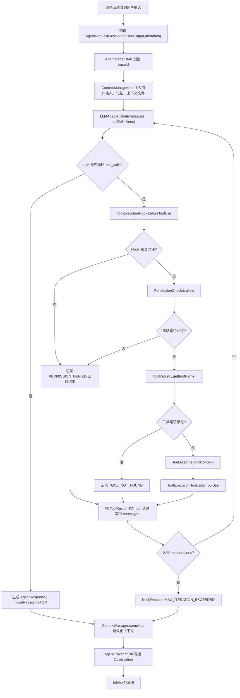
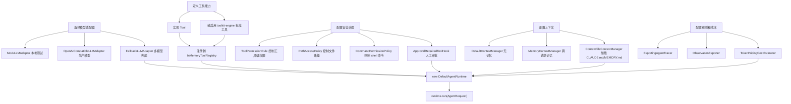
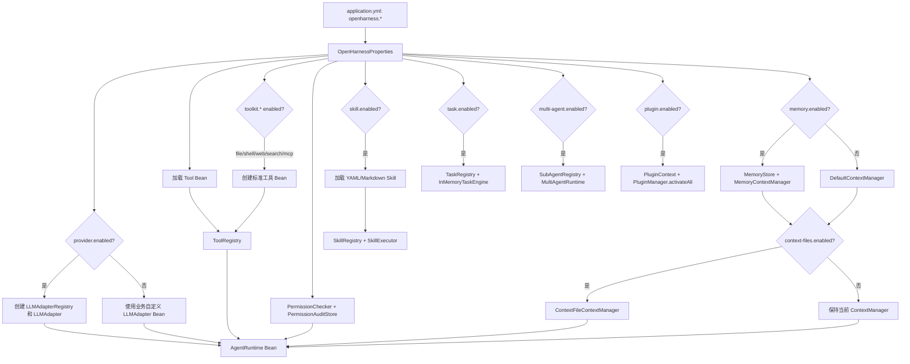
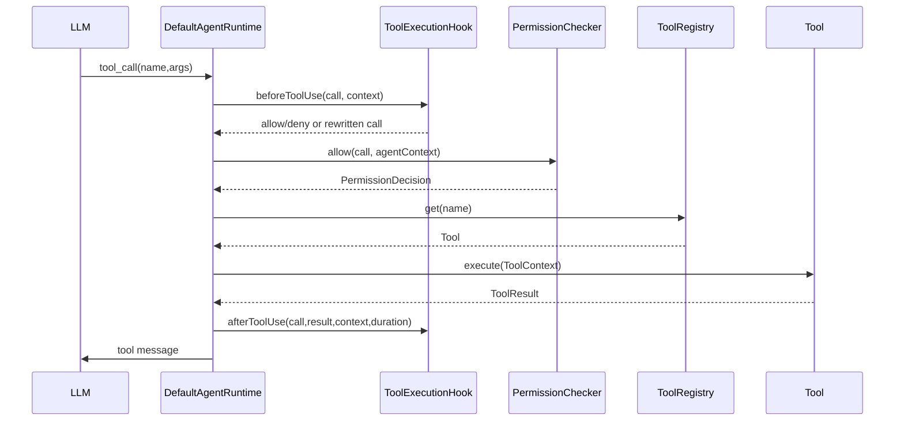
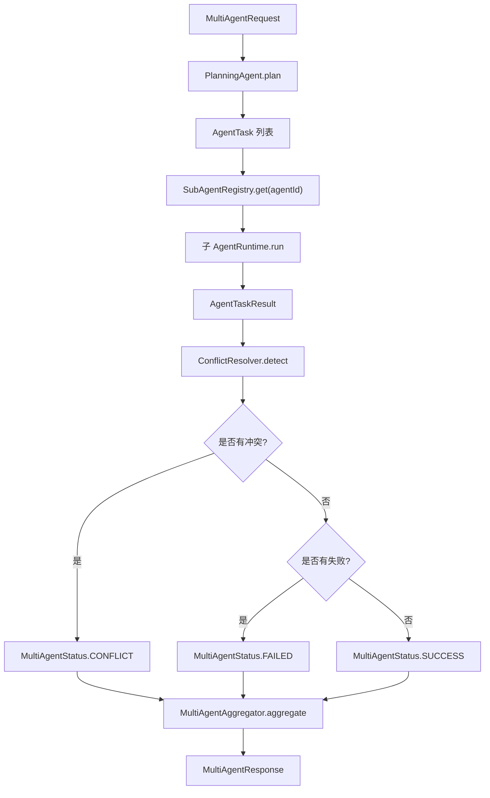
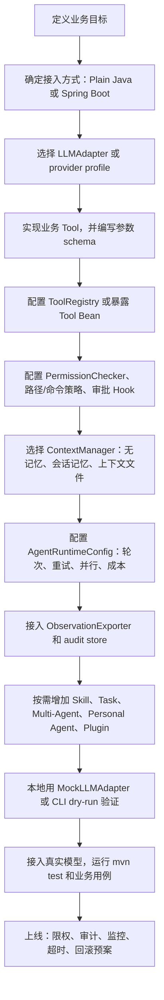

# OpenHarness4j 自定义智能体接入手册

适用版本：`1.5.0-SNAPSHOT`

本文面向“自己开发一个业务智能体，并接入 OpenHarness4j 框架”的场景。读完后你应该能完成四件事：

1. 选清楚 Plain Java、Spring Boot、CLI、个人智能体、团队智能体等接入方式。
2. 写出自己的 `Tool`、`LLMAdapter`、`Skill`、`TaskHandler`、`SubAgent` 或 `Plugin`。
3. 配好模型、工具、安全策略、记忆、观测、异步任务和多智能体运行。
4. 用流程图理解框架配置链路和运行时链路。

## 1. 框架全景

OpenHarness4j 是一个可嵌入 Java 业务系统的智能体运行框架。核心职责是：把用户输入、上下文、LLM、工具调用、权限治理、审计、观测、记忆和多智能体协作串成一个可控的 Agent Loop。

### 1.1 模块与功能

| 模块 | Maven Artifact | 主要功能 | 什么时候使用 |
| --- | --- | --- | --- |
| `api` | `openharness-api` | 公共数据结构：请求、响应、消息、工具调用、权限决策、成本、用量 | 所有模块基础依赖 |
| `llm-adapter` | `openharness-llm-adapter` | `LLMAdapter`、Mock、OpenAI-compatible HTTP 适配器、Fallback、Provider Profile | 接入 OpenAI 兼容模型或自定义模型 |
| `tool-engine` | `openharness-tool-engine` | `Tool`、`ToolRegistry`、内存工具注册表 | 自定义工具、注册工具 |
| `toolkit-engine` | `openharness-toolkit-engine` | 标准工具：File、Shell、Web Fetch、Search、MCP Client | 想直接使用受治理的基础工具 |
| `permission-engine` | `openharness-permission-engine` | 工具权限、路径策略、命令策略、审批 Hook、审计 Store | 生产环境必须使用 |
| `observability` | `openharness-observability` | Trace、Observation、Exporter、敏感参数脱敏 | 需要追踪、审计、成本与失败原因 |
| `agent-runtime` | `openharness-agent-runtime` | 默认 Agent Loop、事件流、重试、并行工具、成本估算 | 自定义智能体最核心模块 |
| `memory-engine` | `openharness-memory-engine` | 会话记忆、窗口压缩、Redis/JDBC/MySQL、`CLAUDE.md`、`MEMORY.md` | 需要跨请求记忆或上下文文件 |
| `skill-engine` | `openharness-skill-engine` | Java/YAML/Markdown 技能、Prompt + Workflow 执行 | 把固定流程封装成可复用技能 |
| `task-engine` | `openharness-task-engine` | 异步任务、状态查询、取消、超时 | 后台长任务、消息渠道回调 |
| `multi-agent` | `openharness-multi-agent` | 规划、子智能体注册、聚合、冲突检测 | 需要多个智能体分工协作 |
| `personal-agent` | `openharness-personal-agent` | Direct、Slack、飞书、Telegram、Discord 通道，个人工作区、历史、审计、团队运行时 | 做面向用户或 IM 渠道的长期智能体 |
| `plugin-engine` | `openharness-plugin-engine` | 插件描述、激活生命周期、注册工具/技能/任务/子智能体 | 把能力打包成插件 |
| `starter` | `openharness-spring-boot-starter` | Spring Boot 自动装配、`openharness.*` 配置 | Spring Boot 项目推荐入口 |
| `cli` | `openharness-cli` | 本地 prompt、interactive、JSON/stream-json、dry-run | 本地验证、脚本化调试 |
| `examples` | `openharness-examples` | 可运行示例和特性验证 | 学习和回归验证 |

## 2. 核心概念

| 概念 | 类或接口 | 说明 |
| --- | --- | --- |
| 智能体请求 | `AgentRequest` | 包含 `sessionId`、`userId`、`input`、`metadata` |
| 智能体响应 | `AgentResponse` | 返回 `content`、工具调用记录、token 用量、`traceId`、结束原因 |
| 消息 | `Message` | 支持 `system`、`user`、`assistant`、`tool` 角色 |
| 工具调用 | `ToolCall` | LLM 发出的函数调用，包含 `id`、`name`、`args` |
| 工具实现 | `Tool` | 开发者实现 `name()`、`description()`、`definition()`、`execute()` |
| 工具上下文 | `ToolContext` | 工具执行时拿到 session、user、trace、call id、args、metadata |
| 工具结果 | `ToolResult` | 支持 `success`、`failed`、`permissionDenied` |
| 模型适配器 | `LLMAdapter` | 把消息和工具定义传给模型，返回 `LLMResponse` |
| 权限检查 | `PermissionChecker` | 每次工具执行前判断是否允许 |
| 执行 Hook | `ToolExecutionHook` | 可在工具调用前后做审批、改写、审计、指标 |
| 上下文管理 | `ContextManager` | `init()` 注入历史或系统上下文，`complete()` 持久化 |
| 运行时配置 | `AgentRuntimeConfig` | 最大轮次、工具并行、LLM/工具重试、成本估算 |
| 观测追踪 | `AgentTracer` | 创建 `AgentTrace`，完成时导出 `AgentObservation` |

## 3. 运行时流程图



## 4. 选择接入方式

### 4.1 Plain Java

适合普通 Java 服务、SDK、内部工具或想完全手动组装依赖的场景。

```xml
<dependency>
    <groupId>io.openharness4j</groupId>
    <artifactId>openharness-agent-runtime</artifactId>
    <version>1.5.0-SNAPSHOT</version>
</dependency>
```

按需增加：

```xml
<dependency>
    <groupId>io.openharness4j</groupId>
    <artifactId>openharness-toolkit-engine</artifactId>
    <version>1.5.0-SNAPSHOT</version>
</dependency>
<dependency>
    <groupId>io.openharness4j</groupId>
    <artifactId>openharness-memory-engine</artifactId>
    <version>1.5.0-SNAPSHOT</version>
</dependency>
<dependency>
    <groupId>io.openharness4j</groupId>
    <artifactId>openharness-skill-engine</artifactId>
    <version>1.5.0-SNAPSHOT</version>
</dependency>
```

### 4.2 Spring Boot

适合业务服务。推荐使用 Starter 自动创建 `ToolRegistry`、`PermissionChecker`、`ContextManager`、`SkillExecutor`、`TaskEngine`、`MultiAgentRuntime`、`PluginManager` 和 `AgentRuntime`。

```xml
<dependency>
    <groupId>io.openharness4j</groupId>
    <artifactId>openharness-spring-boot-starter</artifactId>
    <version>1.5.0-SNAPSHOT</version>
</dependency>
```

### 4.3 CLI

适合本地验证工具、技能、模型配置和 dry-run。

```bash
mvn -q -pl cli -am exec:java -Dexec.args="-p hello --mock-response 'ok'"
```

### 4.4 Personal Agent 和 Team Runtime

适合 Slack、飞书、Telegram、Discord、Direct 消息通道，或长期运行的团队智能体。

```xml
<dependency>
    <groupId>io.openharness4j</groupId>
    <artifactId>openharness-personal-agent</artifactId>
    <version>1.5.0-SNAPSHOT</version>
</dependency>
```

## 5. 最小可运行智能体

### 5.1 自定义工具

工具是智能体能真正操作业务系统的接口。一个工具通常需要：

1. 稳定的工具名，模型会按这个名字调用。
2. 清晰的描述，帮助模型知道何时使用。
3. JSON Schema 参数定义。
4. 参数校验和明确的失败码。

```java
import io.openharness4j.api.ToolContext;
import io.openharness4j.api.ToolDefinition;
import io.openharness4j.api.ToolResult;
import io.openharness4j.tool.Tool;

import java.util.List;
import java.util.Map;

public class CustomerLookupTool implements Tool {
    @Override
    public String name() {
        return "customer_lookup";
    }

    @Override
    public String description() {
        return "Look up a customer profile by customer id.";
    }

    @Override
    public ToolDefinition definition() {
        return new ToolDefinition(
                name(),
                description(),
                Map.of(
                        "type", "object",
                        "properties", Map.of(
                                "customerId", Map.of("type", "string", "description", "Business customer id")
                        ),
                        "required", List.of("customerId")
                )
        );
    }

    @Override
    public ToolResult execute(ToolContext context) {
        Object raw = context.args().get("customerId");
        if (!(raw instanceof String customerId) || customerId.isBlank()) {
            return ToolResult.failed("INVALID_ARGS", "customerId must be a non-empty string");
        }

        return ToolResult.success(
                "customerId=" + customerId + "\nlevel=VIP\nowner=Alice",
                Map.of("customerId", customerId, "level", "VIP")
        );
    }
}
```

### 5.2 组装 Plain Java Runtime

```java
import io.openharness4j.api.AgentRequest;
import io.openharness4j.api.AgentResponse;
import io.openharness4j.llm.OpenAICompatibleLLMAdapter;
import io.openharness4j.observability.ExportingAgentTracer;
import io.openharness4j.observability.InMemoryObservationExporter;
import io.openharness4j.permission.AuditingPermissionChecker;
import io.openharness4j.permission.PermissionPolicy;
import io.openharness4j.permission.PolicyPermissionChecker;
import io.openharness4j.runtime.AgentRuntime;
import io.openharness4j.runtime.AgentRuntimeConfig;
import io.openharness4j.runtime.DefaultAgentRuntime;
import io.openharness4j.runtime.DefaultContextManager;
import io.openharness4j.tool.InMemoryToolRegistry;

import java.util.List;

InMemoryToolRegistry tools = new InMemoryToolRegistry();
tools.register(new CustomerLookupTool());

var llm = new OpenAICompatibleLLMAdapter(
        "https://api.openai.com/v1/chat/completions",
        System.getenv("OPENAI_API_KEY"),
        System.getenv("OPENAI_MODEL")
);

var permissions = new AuditingPermissionChecker(
        new PolicyPermissionChecker(PermissionPolicy.allowByDefault(List.of())),
        null
);

AgentRuntime runtime = new DefaultAgentRuntime(
        llm,
        tools,
        permissions,
        new ExportingAgentTracer(new InMemoryObservationExporter()),
        new DefaultContextManager(),
        AgentRuntimeConfig.defaults()
);

AgentResponse response = runtime.run(
        AgentRequest.of("session-1001", "user-42", "查询客户 C001 的等级")
);
```

### 5.3 配置运行时事件流

```java
AgentResponse response = runtime.run(
        AgentRequest.of("session-1001", "user-42", "查询客户 C001"),
        event -> System.out.println(event.type() + " " + event.message())
);
```

会产生的事件类型包括：

| 事件 | 含义 |
| --- | --- |
| `STARTED` | 运行时启动 |
| `LLM_ATTEMPT` | 开始一次 LLM 调用 |
| `LLM_RETRY` | LLM 调用失败后重试 |
| `LLM_RESPONSE` | 收到 LLM 响应 |
| `TEXT_DELTA` | 收到 assistant 文本 |
| `TOOL_STARTED` | 工具开始执行 |
| `TOOL_RETRY` | 工具执行失败后重试 |
| `TOOL_DONE` | 工具执行结束 |
| `COST_UPDATED` | 成本估算更新 |
| `DONE` | 运行完成 |
| `ERROR` | 运行错误 |

## 6. 配置流程图

### 6.1 Plain Java 手动配置流程



### 6.2 Spring Boot 自动装配流程



## 7. LLM 接入

### 7.1 自定义 LLMAdapter

如果模型不是 OpenAI-compatible 协议，实现 `LLMAdapter` 即可。

```java
public class MyLLMAdapter implements LLMAdapter {
    @Override
    public LLMResponse chat(List<Message> messages, List<ToolDefinition> tools) {
        return LLMResponse.text("业务模型返回内容");
    }
}
```

### 7.2 OpenAI-compatible 适配器

`OpenAICompatibleLLMAdapter` 调用 Chat Completions 兼容接口：

```java
LLMAdapter adapter = new OpenAICompatibleLLMAdapter(
        "https://api.openai.com/v1/chat/completions",
        System.getenv("OPENAI_API_KEY"),
        "gpt-4.1-mini"
);
```

它会把工具转换成 `tools: [{ type: "function", function: ... }]`，并解析返回里的 `tool_calls`、`usage.prompt_tokens`、`usage.completion_tokens`、`usage.total_tokens`。

### 7.3 Mock 和 Fallback

Mock 用于测试：

```java
LLMAdapter mock = new MockLLMAdapter(List.of(
        LLMResponse.toolCalls("calling lookup", List.of(ToolCall.of("customer_lookup", Map.of("customerId", "C001")))),
        LLMResponse.text("客户 C001 是 VIP")
));
```

Fallback 用于多模型兜底：

```java
LLMAdapter adapter = new FallbackLLMAdapter(List.of(primaryAdapter, backupAdapter));
```

### 7.4 Provider Profile

Plain Java：

```java
List<LLMProviderProfile> profiles = List.of(
        new LLMProviderProfile(
                "openai",
                "https://api.openai.com/v1/chat/completions",
                "",
                "OPENAI_API_KEY",
                "",
                "OPENAI_MODEL",
                true
        )
);

LLMAdapter adapter = new LLMProviderProfileFactory()
        .adapter(profiles, "openai", List.of("openai"))
        .orElseThrow();
```

Spring Boot：

```yaml
openharness:
  provider:
    enabled: true
    default-profile: openai
    fallback-order:
      - openai
      - local
    profiles:
      - name: openai
        endpoint: https://api.openai.com/v1/chat/completions
        api-key-env: OPENAI_API_KEY
        model-env: OPENAI_MODEL
      - name: local
        endpoint: http://localhost:11434/v1/chat/completions
        model: llama3.1
```

## 8. 工具系统

### 8.1 自定义工具生命周期



### 8.2 标准工具

| 工具名 | 类 | 参数 | 行为 | 治理点 |
| --- | --- | --- | --- | --- |
| `file` | `FileTool` | `operation`、`path`、`content` | `read`、`write`、`append`、`delete`、`exists`、`list` | `PathAccessPolicy`，且路径不能逃逸 `baseDirectory` |
| `shell` | `ShellTool` | `command`、`timeoutMillis` | 在工作目录执行 shell 命令 | `CommandPermissionPolicy`、超时 |
| `web_fetch` | `WebFetchTool` | `url`、`timeoutMillis` | 仅允许 HTTP/HTTPS GET，默认最多 64KB | 协议限制、超时、响应截断 |
| `search` | `SearchTool` | `query`、`limit` | 调用可插拔 `SearchProvider` | 由业务侧提供搜索实现 |
| `mcp_call` | `McpClientTool` | `server`、`method`、`params` | 调用可插拔 `McpClient` | 由业务侧控制 MCP server |

### 8.3 标准工具注册示例

```java
Path workspace = Path.of("/srv/agent-workspace");

PathAccessPolicy pathPolicy = PathAccessPolicy.denyByDefault(List.of(
        PathAccessRule.allow(workspace, EnumSet.allOf(PathAccessMode.class)),
        PathAccessRule.deny(
                workspace.resolve("secrets"),
                EnumSet.allOf(PathAccessMode.class),
                RiskLevel.HIGH,
                "secret path denied"
        )
));

CommandPermissionPolicy commandPolicy = CommandPermissionPolicy.denyByDefault(List.of(
        CommandPermissionRule.allowPrefix("printf "),
        CommandPermissionRule.denyContains("rm -rf", RiskLevel.HIGH, "destructive command")
));

InMemoryToolRegistry registry = new InMemoryToolRegistry();
registry.register(new FileTool(workspace, pathPolicy));
registry.register(new ShellTool(workspace, commandPolicy));
registry.register(new WebFetchTool());
registry.register(new SearchTool((query, limit) -> List.of(
        new SearchResult("客户手册", "https://internal.example/customers", "客户等级说明")
)));
registry.register(new McpClientTool(request -> ToolResult.success("mcp ok")));
```

## 9. 权限、审批与审计

### 9.1 工具级权限

```java
PermissionPolicy policy = PermissionPolicy.denyByDefault(List.of(
        ToolPermissionRule.allow("customer_lookup"),
        ToolPermissionRule.deny("shell", RiskLevel.HIGH, "shell disabled")
));

PermissionChecker checker = new PolicyPermissionChecker(policy);
```

`allowByDefault` 表示没有命中规则时允许，`denyByDefault` 表示没有命中规则时拒绝。

### 9.2 审计

```java
InMemoryPermissionAuditStore auditStore = new InMemoryPermissionAuditStore();
PermissionChecker checker = new AuditingPermissionChecker(
        new PolicyPermissionChecker(policy),
        auditStore
);
```

每次权限判断都会生成 `PermissionAuditEvent`，记录工具名、参数、trace、用户、是否允许、原因和风险级别。

### 9.3 人工审批 Hook

```java
ToolExecutionHook approvalHook = new ApprovalRequiredToolHook(
        Set.of("shell"),
        RiskLevel.HIGH,
        "shell approval required",
        request -> request.userId().equals("admin")
                ? ToolApprovalDecision.approve("admin approved")
                : ToolApprovalDecision.deny("only admin can run shell")
);
```

多个 Hook 可用 `CompositeToolExecutionHook` 串联。前一个 Hook 可以改写 `ToolCall`，后一个 Hook 会接收改写后的调用。

## 10. 运行时配置

```java
AgentRuntimeConfig config = AgentRuntimeConfig.defaults()
        .withMaxIterations(8)
        .withParallelToolExecution(true)
        .withLlmRetryPolicy(RetryPolicy.fixedDelay(3, 200))
        .withToolRetryPolicy(RetryPolicy.fixedDelay(2, 100))
        .withCostEstimator(new TokenPricingCostEstimator(
                "USD",
                new BigDecimal("1.00"),
                new BigDecimal("2.00")
        ));
```

| 配置 | 默认值 | 说明 |
| --- | --- | --- |
| `maxIterations` | `8` | 防止模型无限工具循环 |
| `parallelToolExecution` | `false` | 同一轮多个工具调用可并行执行，结果仍按模型顺序写回 |
| `llmRetryPolicy` | 1 次，无退避 | LLM 调用失败重试 |
| `toolRetryPolicy` | 1 次，无退避 | 工具抛 `RuntimeException` 时重试，参数错误不重试 |
| `costEstimator` | `Cost.zero()` | 按 token 用量估算成本 |

结束原因：

| FinishReason | 场景 |
| --- | --- |
| `STOP` | 模型给出最终答案 |
| `ERROR` | LLM 空响应、LLM 失败、上下文收尾失败等 |
| `PERMISSION_DENIED` | 预留枚举，工具拒绝通常作为工具结果回写给模型 |
| `TOOL_NOT_FOUND` | 预留枚举，缺失工具通常作为工具结果回写给模型 |
| `MAX_ITERATION_EXCEEDED` | 达到最大迭代轮数 |

## 11. 记忆与上下文

### 11.1 MemoryStore

| 实现 | 说明 |
| --- | --- |
| `InMemoryMemoryStore` | 本地内存，适合测试 |
| `RedisMemoryStore` | 通过 RESP 协议使用 Redis List 存消息 |
| `JdbcMemoryStore` | 使用 JDBC 表 `openharness_memory` |
| `MySqlMemoryStore` | JDBC Store 的 MySQL 便捷子类 |

### 11.2 会话记忆

```java
MemoryStore memoryStore = new InMemoryMemoryStore();
ContextManager context = new MemoryContextManager(
        memoryStore,
        new MemoryWindowPolicy(20, true, new SimpleMemorySummarizer())
);
```

`MemoryWindowPolicy` 会限制上下文窗口。超过最大消息数时：

1. `summarizeOverflow=true`：把被丢弃的旧消息压缩成一条 system summary。
2. `summarizeOverflow=false`：只保留最后 N 条。

### 11.3 上下文文件

`ContextFileContextManager` 会从 `baseDirectory` 向父目录查找：

| 文件 | 用途 |
| --- | --- |
| `CLAUDE.md` | 作为项目指令注入 system message |
| `MEMORY.md` | 作为持久记忆注入 system message，可在完成后重写 |

```java
ContextManager context = new ContextFileContextManager(
        new MemoryContextManager(memoryStore),
        Path.of("."),
        true,
        true,
        true,
        new SimpleMemorySummarizer()
);
```

### 11.4 显式会话 API

```java
MemorySessionManager sessions = new MemorySessionManager(memoryStore);
sessions.append("session-1", Message.user("remember this"));
List<Message> history = sessions.resume("session-1");
sessions.clear("session-1");
```

## 12. 技能 Skill

Skill 适合把“固定工作流”封装起来，例如：读取文件、调用业务工具、再让模型总结。

### 12.1 Java DSL

```java
SkillDefinition skill = SkillDefinition.builder("customer_brief", "1.0.0")
        .name("Customer Brief")
        .description("Create a customer brief.")
        .inputSchema(Map.of("type", "object", "required", List.of("customerId")))
        .requiredTool("customer_lookup")
        .toolStep("lookup", "customer_lookup", Map.of("customerId", "{{customerId}}"))
        .llmStep("summarize", "请基于客户信息生成摘要：{{steps.lookup.output}}")
        .build();

InMemorySkillRegistry skills = new InMemorySkillRegistry();
skills.register(skill);
```

### 12.2 Markdown Skill

```markdown
---
name: Customer Brief
version: 1.0.0
requiredTools:
  - customer_lookup
inputSchema:
  type: object
  required:
    - customerId
workflow:
  - name: lookup
    type: tool
    tool: customer_lookup
    args:
      customerId: "{{customerId}}"
  - name: summarize
    type: llm
    prompt: "请基于客户信息生成摘要：{{steps.lookup.output}}"
---
```

没有显式 `workflow` 的 Markdown Skill 会把正文作为默认 LLM prompt。

### 12.3 YAML Skill

```yaml
id: customer_brief
version: 1.0.0
name: Customer Brief
inputSchema:
  type: object
  required:
    - customerId
requiredTools:
  - customer_lookup
workflow:
  - name: lookup
    type: tool
    tool: customer_lookup
    args:
      customerId: "{{customerId}}"
  - name: summarize
    type: llm
    prompt: "请基于客户信息生成摘要：{{steps.lookup.output}}"
```

### 12.4 执行 Skill

```java
DefaultSkillExecutor executor = new DefaultSkillExecutor(
        skills,
        llmAdapter,
        toolRegistry,
        permissionChecker,
        agentTracer,
        contextManager,
        AgentRuntimeConfig.defaults()
);

SkillRunResponse response = executor.run(SkillRunRequest.of(
        "customer_brief",
        "session-1",
        "user-1",
        Map.of("customerId", "C001")
));
```

模板变量：

| 变量 | 说明 |
| --- | --- |
| `{{customerId}}` | 直接读取输入字段 |
| `{{input.customerId}}` | 从完整输入对象读取 |
| `{{metadata.xxx}}` | 从请求 metadata 读取 |
| `{{steps.lookup.output}}` | 读取前一步输出 |

## 13. 异步任务 Task Engine

Task Engine 适合后台执行、轮询状态、取消和超时。

### 13.1 自定义 TaskHandler

```java
TaskHandler reportHandler = new TaskHandler() {
    @Override
    public String type() {
        return "daily_report";
    }

    @Override
    public TaskResult handle(TaskContext context) throws Exception {
        while (!context.cancellationRequested()) {
            break;
        }
        return TaskResult.success("report ready", Map.of("name", context.input().get("name")));
    }
};
```

### 13.2 提交、查询、取消

```java
InMemoryTaskRegistry registry = new InMemoryTaskRegistry();
registry.register(reportHandler);

try (InMemoryTaskEngine engine = new InMemoryTaskEngine(registry, 30_000, 4)) {
    TaskSubmission submission = engine.submit(TaskRequest.withTimeout(
            "daily_report",
            Map.of("name", "daily"),
            10_000
    ));

    Optional<TaskSnapshot> snapshot = engine.get(submission.taskId());
    boolean cancelled = engine.cancel(submission.taskId());
}
```

任务状态：

| 状态 | 含义 |
| --- | --- |
| `PENDING` | 已提交，等待执行 |
| `RUNNING` | 正在执行 |
| `SUCCEEDED` | 成功 |
| `FAILED` | 失败 |
| `CANCELLED` | 被取消 |
| `TIMED_OUT` | 超时 |

## 14. 多智能体 Multi-Agent

Multi-Agent 用于多个子智能体分工执行同一请求，然后聚合结果。



### 14.1 注册子智能体

```java
InMemorySubAgentRegistry registry = new InMemorySubAgentRegistry();
registry.register(new SubAgentDefinition("researcher", "资料检索", researcherRuntime));
registry.register(new SubAgentDefinition("writer", "内容撰写", writerRuntime));

MultiAgentRuntime runtime = new DefaultMultiAgentRuntime(registry);
MultiAgentResponse response = runtime.run(
        MultiAgentRequest.of("session-1", "user-1", "生成竞品分析")
);
```

### 14.2 自定义计划

默认 `DefaultPlanningAgent` 会让每个注册子智能体都执行一次。如果请求 metadata 里包含 `multiAgentTasks`，则按显式任务执行。

```java
MultiAgentRequest request = new MultiAgentRequest(
        "session-1",
        "user-1",
        "生成竞品分析",
        Map.of("multiAgentTasks", List.of(
                Map.of("agentId", "researcher", "instruction", "收集竞品资料"),
                Map.of("agentId", "writer", "instruction", "根据资料生成报告")
        ))
);
```

### 14.3 冲突检测

`KeyValueConflictResolver` 会读取成功结果中的 `key=value` 行。如果两个智能体返回同一个 key 的不同 value，就生成 `AgentConflict`，最终状态为 `CONFLICT`。

## 15. Personal Agent 与 Team Runtime

### 15.1 Personal Agent

Personal Agent 把通道消息转换成后台任务，并维护个人工作区、会话历史、任务状态和审计事件。

```java
try (DefaultPersonalAgentService personalAgent = new DefaultPersonalAgentService(runtime)) {
    PersonalAgentMessage message = new SlackChannelAdapter().toMessage(Map.of(
            "channel_id", "C123",
            "user_id", "U123",
            "text", "准备本周周报"
    ));

    PersonalAgentSubmission submission = personalAgent.submit(message);
    PersonalAgentTaskSnapshot snapshot = personalAgent.get(submission.taskId()).orElseThrow();
    List<PersonalAgentHistoryEntry> history = personalAgent.history("U123", "C123");
}
```

通道适配器：

| 适配器 | channel | 常用字段 |
| --- | --- | --- |
| `DirectChannelAdapter` | `direct` | `conversationId/sessionId`、`userId/user`、`text/message` |
| `SlackChannelAdapter` | `slack` | `channel_id/channel/conversationId`、`user_id/user/userId`、`text` |
| `FeishuChannelAdapter` | `feishu` | `chat_id/open_chat_id/conversationId`、`sender_id/open_id/userId`、`text/content` |
| `TelegramChannelAdapter` | `telegram` | `chat_id/conversationId`、`from_id/user_id/userId`、`text` |
| `DiscordChannelAdapter` | `discord` | `channel_id/conversationId`、`author_id/user_id/userId`、`content/text` |

### 15.2 Team Runtime

Team Runtime 管理长期存在的团队智能体，支持 spawn、状态查询、取消和归档。

```java
InMemoryTeamAgentRegistry teamRegistry = new InMemoryTeamAgentRegistry();
teamRegistry.register(new TeamAgentDefinition("researcher", "Research", researcherRuntime));

try (TeamRuntime teamRuntime = new InMemoryTeamRuntime(teamRegistry)) {
    TeamAgentSubmission spawned = teamRuntime.spawn(TeamAgentRequest.of(
            "researcher",
            "session-1",
            "user-1",
            "收集市场资料"
    ).withTimeoutMillis(30_000));

    TeamAgentSnapshot snapshot = teamRuntime.get(spawned.taskId()).orElseThrow();
    Optional<TeamAgentArchive> archive = teamRuntime.archive(spawned.taskId());
}
```

## 16. Plugin 插件

插件适合把一组工具、技能、任务或子智能体打包。

```java
public class CustomerPlugin implements OpenHarnessPlugin {
    @Override
    public PluginDescriptor descriptor() {
        return new PluginDescriptor("customer-plugin", "1.0.0", "Customer Plugin");
    }

    @Override
    public void activate(PluginContext context) {
        context.toolRegistry().register(new CustomerLookupTool());
        context.skillRegistry().register(SkillDefinition.builder("customer_brief", "1.0.0")
                .toolStep("lookup", "customer_lookup", Map.of("customerId", "{{customerId}}"))
                .llmStep("summarize", "总结：{{steps.lookup.output}}")
                .build());
    }
}
```

Plain Java：

```java
PluginManager manager = new PluginManager(
        new InMemoryPluginRegistry(),
        new PluginContext(toolRegistry, skillRegistry, taskRegistry, subAgentRegistry),
        List.of(new CustomerPlugin())
);
manager.activateAll();
```

Spring Boot 中只要暴露 `OpenHarnessPlugin` Bean，`PluginManager` 会自动激活。

## 17. 观测、审计与成本

### 17.1 Trace 和 Observation

`DefaultAgentTracer` 会创建 `traceId`。如果 `AgentRequest.metadata` 包含 `traceId`，会复用该值。

```java
InMemoryObservationExporter exporter = new InMemoryObservationExporter();
AgentTracer tracer = new ExportingAgentTracer(exporter);
```

完成时导出的 `AgentObservation` 包含：

| 字段 | 说明 |
| --- | --- |
| `traceId` | 本次运行 ID |
| `startedAt`、`finishedAt` | 开始和结束时间 |
| `finishReason` | 结束原因 |
| `usage` | token 用量 |
| `cost` | 成本估算 |
| `toolCalls` | 工具调用记录 |
| `errors` | 运行时错误 |

工具参数会对包含 `password`、`secret`、`token`、`apikey`、`api_key`、`authorization` 的 key 做脱敏。

### 17.2 成本估算

```java
CostEstimator estimator = new TokenPricingCostEstimator(
        "USD",
        new BigDecimal("1.00"),
        new BigDecimal("2.00")
);
```

计算方式是：

```text
promptTokens * promptTokenPricePerMillion / 1_000_000
+ completionTokens * completionTokenPricePerMillion / 1_000_000
```

## 18. Spring Boot 完整配置示例

```yaml
openharness:
  agent:
    max-iterations: 8
    parallel-tool-execution: true
    llm-retry-max-attempts: 3
    llm-retry-backoff-millis: 200
    tool-retry-max-attempts: 2
    tool-retry-backoff-millis: 100

  provider:
    enabled: true
    default-profile: openai
    fallback-order:
      - openai
      - local
    profiles:
      - name: openai
        endpoint: https://api.openai.com/v1/chat/completions
        api-key-env: OPENAI_API_KEY
        model-env: OPENAI_MODEL
      - name: local
        endpoint: http://localhost:11434/v1/chat/completions
        model: llama3.1

  permission:
    default-allow: false
    allowed-tools:
      - customer_lookup
      - file
      - search
    denied-tools:
      - shell

  toolkit:
    base-directory: /srv/agent-workspace
    file:
      enabled: true
      allowed-paths:
        - .
      denied-paths:
        - secrets
    shell:
      enabled: false
      allowed-prefixes:
        - "printf "
      denied-contains:
        - "rm -rf"
      default-timeout-millis: 10000
    web-fetch:
      enabled: true
    search:
      enabled: true
    mcp:
      enabled: false

  memory:
    enabled: true
    max-messages: 20
    summarize-overflow: true
    context-files:
      enabled: true
      base-directory: .
      load-claude: true
      load-memory: true
      persist-memory: false

  skill:
    enabled: true
    yaml-locations:
      - classpath*:openharness/skills/*.yaml
      - classpath*:openharness/skills/*.yml
    markdown-locations:
      - classpath*:openharness/skills/*.md
      - classpath*:openharness/skills/*/SKILL.md

  task:
    enabled: true
    default-timeout-millis: 30000
    pool-size: 4

  multi-agent:
    enabled: true

  plugin:
    enabled: true
```

### 18.1 Spring Boot 业务 Bean

```java
@Configuration
class AgentBeans {
    @Bean
    Tool customerLookupTool() {
        return new CustomerLookupTool();
    }

    @Bean
    SearchProvider searchProvider() {
        return (query, limit) -> List.of(
                new SearchResult("内部知识库", "https://internal.example/search?q=" + query, "搜索结果摘要")
        );
    }

    @Bean
    CostEstimator costEstimator() {
        return new TokenPricingCostEstimator(
                "USD",
                new BigDecimal("1.00"),
                new BigDecimal("2.00")
        );
    }
}
```

### 18.2 Spring Boot Controller 示例

```java
@RestController
class AgentController {
    private final AgentRuntime runtime;

    AgentController(AgentRuntime runtime) {
        this.runtime = runtime;
    }

    @PostMapping("/agent/run")
    AgentResponse run(@RequestBody RunAgentRequest request) {
        return runtime.run(new AgentRequest(
                request.sessionId(),
                request.userId(),
                request.input(),
                Map.of("traceId", request.traceId())
        ));
    }
}

record RunAgentRequest(String sessionId, String userId, String input, String traceId) {
}
```

## 19. CLI 使用

### 19.1 本地 prompt

```bash
mvn -q -pl cli -am exec:java -Dexec.args="-p 'hello' --mock-response 'cli ok'"
```

### 19.2 JSON 输出

```bash
mvn -q -pl cli -am exec:java -Dexec.args="-p hello --mock-response 'json ok' --output json"
```

### 19.3 流式事件 JSON

```bash
mvn -q -pl cli -am exec:java -Dexec.args="-p hello --mock-response 'stream ok' --output stream-json"
```

### 19.4 dry-run

dry-run 不调用模型、不执行工具，只检查配置是否准备好。

```bash
mvn -q -pl cli -am exec:java -Dexec.args="--dry-run --mock-response ready --enable-tool echo --tool echo --output json"
```

常用参数：

| 参数 | 说明 |
| --- | --- |
| `--prompt` 或 `-p` | 单次 prompt |
| `--interactive` 或 `-i` | 交互模式 |
| `--session` | 会话 ID |
| `--user` | 用户 ID |
| `--mock-response` | 本地 Mock 模型 |
| `--provider-endpoint` | OpenAI-compatible endpoint |
| `--provider-model` | 模型名 |
| `--provider-api-key-env` | API key 环境变量 |
| `--enable-tool` | 启用内置 `echo,file,shell,web_fetch,search,mcp_call` |
| `--deny-tool` | CLI 权限策略拒绝某工具 |
| `--tool` | dry-run 声明预期使用的工具 |
| `--skill` | 选择技能 |
| `--skill-location` | 加载技能文件或目录 |
| `--mcp-server` | dry-run 声明 MCP server |

## 20. 生产接入建议

1. 工具名一旦上线尽量保持稳定，模型 prompt、历史和技能都会依赖它。
2. 每个工具都要返回明确错误码，不要把业务异常直接抛给运行时。
3. 生产环境不要对 `shell`、`file` 使用宽松默认允许策略。
4. 文件工具必须设置 `baseDirectory` 和 `PathAccessPolicy`。
5. Shell 工具必须设置命令白名单、危险命令黑名单、超时和审批 Hook。
6. 跨请求记忆要用稳定的 `sessionId`，否则历史无法恢复。
7. 高价值业务操作建议使用 `ToolExecutionHook` 做二次确认或人工审批。
8. 外部模型至少配置 LLM 重试，幂等工具可以配置工具重试。
9. 会产生副作用的工具要把幂等键放入 `metadata` 或工具参数。
10. 使用 `AgentEventSink` 或 `ExportingAgentTracer` 接入日志、指标和审计。
11. 将插件用于“成套能力”分发：工具、技能、任务和子智能体一起注册。
12. 上线前运行 `mvn test` 和 examples 验证。

## 21. 从零接入清单



## 22. 验证命令

```bash
mvn test
mvn -q -pl examples -am package exec:java
```

`examples` 的特性验证会覆盖文本响应、单工具、多工具、权限拒绝、缺失工具、参数错误、工具异常、空 LLM 响应、token 聚合、最大轮次、记忆、技能、任务、多智能体、生产运行时、治理工具、provider profile、personal agent 和 team runtime。
