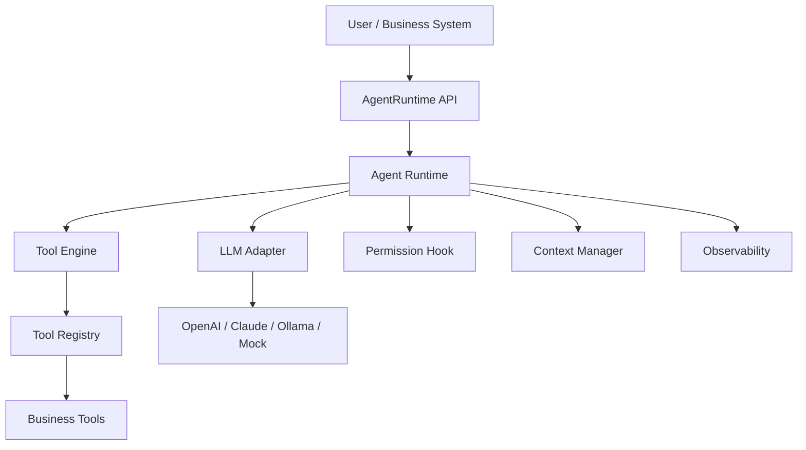
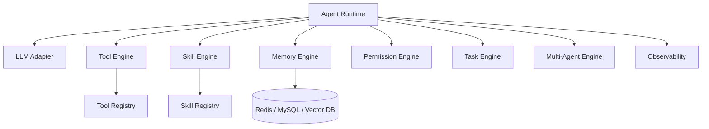

# OpenHarness4j 产品文档（MVP v0.1）

## 一、项目背景

随着大模型（LLM）的发展，AI 正在从“对话工具”演进为“执行工具”。传统 AI 应用通常只能回答问题，缺少调用系统能力、持续执行任务、接入业务工具和沉淀上下文的统一运行时。

当前常见问题：

* AI 只能生成文本，不能稳定调用数据库、API、文件、Shell 等系统能力。
* 不同业务重复实现 Agent Loop、Tool 调用、权限控制和日志追踪。
* 模型供应商接口差异较大，应用层直接耦合 OpenAI、Claude、Ollama 等模型协议。
* 工具执行缺少统一的权限拦截、异常处理、调用链记录和可测试标准。
* 长期来看，需要支持 Memory、Skill、Multi-Agent、异步任务等能力，但第一版必须先建立可靠的执行内核。

核心问题：

> 如何让 AI 从“会说话”变成“可控地做事”？

解决方案：

引入 **Agent Harness（智能体运行时）**，让模型负责决策，让系统负责执行。

```text
模型负责决策
系统负责执行
运行时负责连接、控制和观测
```

---

## 二、文档定位与版本范围

### 2.1 文档定位

本文档是 OpenHarness4j 的产品需求文档和研发落地规格，面向 Java 后端研发、AI 应用开发者和后续维护者。

本文档需要回答：

* v0.1 要交付什么能力。
* v0.1 不交付什么能力。
* 运行时的最小公开接口是什么。
* Agent Loop 如何执行、如何中断、如何处理异常。
* 如何判断 MVP 完成并可验收。

### 2.2 版本主线

MVP v0.1 的主线是：

> 构建一个最小可用 Java Agent Runtime，让业务系统可以注册工具、接入 LLM、发起 Agent 请求，并让模型在受控权限下调用工具完成任务。

### 2.3 v0.1 交付范围

| 模块 | v0.1 是否交付 | 说明 |
| --- | --- | --- |
| Agent Loop | 是 | 支持模型响应、工具调用、结果回写和循环终止 |
| LLM Adapter | 是 | 定义统一接口，至少支持一个可运行实现或 mock 实现 |
| Tool System | 是 | 支持工具定义、注册、查找、执行和结果返回 |
| Permission Hook | 是 | 在工具执行前提供权限拦截点 |
| 会话上下文 | 是 | 支持单次请求内消息上下文和 sessionId 传递 |
| 基础可观测 | 是 | 记录 traceId、工具调用链、耗时、token usage |
| Memory | 否 | v0.1 只保留接口预留，不实现长期记忆 |
| Skill | 否 | v0.1 不实现 Prompt + Workflow 技能编排 |
| Multi-Agent | 否 | v0.1 不实现多智能体协作 |
| Task Engine | 否 | v0.1 不实现异步任务、定时任务和任务恢复 |
| 插件市场 | 否 | v0.1 不实现插件包发布、安装和版本管理 |

### 2.4 v0.1 非目标

v0.1 明确不做：

* 不提供生产级权限审批流，只提供执行前权限判断接口。
* 不提供长期记忆、向量检索、用户画像沉淀。
* 不提供多 Agent 编排、任务拆解、子 Agent 调度。
* 不提供异步任务持久化、任务暂停恢复、分布式调度。
* 不提供前端控制台、插件市场、可视化编排器。
* 不承诺兼容所有 LLM 的高级特性，只抽象最小 chat + tool call 能力。

---

## 三、产品目标与用户场景

### 3.1 产品目标

OpenHarness4j 的长期目标是成为通用 Java Agent 内核，可嵌入任意业务系统，不绑定具体行业，并支持多模型、工具、技能、记忆、权限、任务和多智能体扩展。

MVP v0.1 的目标更聚焦：

* 让 Java 应用可以用统一接口运行一个 Agent。
* 让模型可以基于工具定义发起 tool call。
* 让业务代码可以注册 Java Tool，并拿到结构化执行上下文。
* 让工具执行前经过权限判断。
* 让每次运行可追踪、可测试、可复现关键路径。

### 3.2 目标用户

| 用户 | 诉求 | v0.1 提供的价值 |
| --- | --- | --- |
| Java 后端研发 | 在现有系统中接入 AI 执行能力 | 通过 AgentRuntime 和 ToolRegistry 嵌入 |
| AI 应用开发者 | 快速构建可调用工具的 Agent | 复用 Agent Loop、LLM Adapter、Tool System |
| 企业内部工具平台 | 让 AI 安全调用内部 API | 统一权限拦截、traceId 和调用日志 |
| 框架贡献者 | 扩展模型、工具、记忆、技能模块 | 清晰的接口边界和后续路线图 |

### 3.3 核心场景

场景一：工具调用型助手

* 用户输入：“查询订单 10001 的物流状态。”
* LLM 判断需要调用 `query_order` 工具。
* Runtime 检查权限、执行工具、把结果写回上下文。
* LLM 基于工具结果生成最终回答。

场景二：业务自动化 Agent

* 用户输入：“帮我统计今天失败的支付订单，并给出原因分类。”
* LLM 调用订单查询工具和统计工具。
* Runtime 记录每次工具调用、耗时和 traceId。
* 最终返回结构化分析结果。

场景三：可嵌入式 AI 执行内核

* 业务系统将 OpenHarness4j 作为 library 引入。
* 系统注册自定义工具和权限策略。
* 业务入口只调用 `AgentRuntime.run(request)`。

---

## 四、整体架构

### 4.1 MVP v0.1 架构图



### 4.2 长期架构预留



长期能力仍然保留在产品方向中，但 v0.1 的研发优先级必须围绕最小 Agent Runtime，不提前实现大而全的编排系统。

---

## 五、MVP 功能需求

### 5.1 Agent Runtime

作用：驱动整个 AI 执行流程。

核心流程：

```text
用户输入 -> 构建上下文 -> 调用 LLM -> 判断是否需要工具
-> 权限检查 -> 工具执行 -> 结果写回上下文 -> 继续 LLM
-> 返回最终响应
```

功能要求：

| 编号 | 需求 | 验收标准 |
| --- | --- | --- |
| AR-01 | 对外提供 `AgentRuntime.run(AgentRequest request)` | 调用后返回 `AgentResponse` |
| AR-02 | 支持普通文本响应 | LLM 不返回 tool call 时直接结束 |
| AR-03 | 支持单工具调用 | 能执行一个工具并把结果写回 messages |
| AR-04 | 支持多工具调用 | 按 LLM 返回顺序串行执行多个工具 |
| AR-05 | 支持最大循环次数 | 默认 8 次，超过返回 `MAX_ITERATION_EXCEEDED` |
| AR-06 | 支持 traceId | 每次 run 都能生成或透传 traceId |

### 5.2 LLM Adapter

作用：屏蔽不同模型供应商差异，向 Runtime 暴露统一 chat 接口。

功能要求：

| 编号 | 需求 | 验收标准 |
| --- | --- | --- |
| LLM-01 | 定义统一 `LLMAdapter` 接口 | Runtime 不直接依赖具体供应商 SDK |
| LLM-02 | 支持 messages 输入 | 能传入 system、user、assistant、tool 消息 |
| LLM-03 | 支持工具定义输入 | 能把 `ToolDefinition` 转给模型 |
| LLM-04 | 支持 tool call 输出 | 能解析模型返回的工具名和参数 |
| LLM-05 | 支持 usage 输出 | 返回 prompt tokens、completion tokens、total tokens |
| LLM-06 | 支持 mock 实现 | 单元测试无需真实调用外部模型 |

### 5.3 Tool System

作用：给 AI 可执行的“手”。

v0.1 内置能力不是重点，重点是稳定的工具扩展接口。业务方可以注册自己的工具，例如文件读取、数据库查询、HTTP API、订单查询、报表统计等。

功能要求：

| 编号 | 需求 | 验收标准 |
| --- | --- | --- |
| TOOL-01 | 定义 `Tool` 接口 | 工具能声明名称、描述、参数 schema 和执行逻辑 |
| TOOL-02 | 提供 `ToolRegistry` | 支持注册、查找、列出工具 |
| TOOL-03 | 工具名称唯一 | 重名注册应失败或覆盖策略明确 |
| TOOL-04 | 工具执行入参结构化 | `ToolContext` 包含 args、sessionId、userId、traceId、metadata |
| TOOL-05 | 工具结果结构化 | `ToolResult` 区分 success、failed、permission denied |
| TOOL-06 | 工具结果可回写 LLM | `ToolResult` 能转换为 tool message |

### 5.4 Permission Hook

作用：防止 AI 做危险操作，给业务系统保留安全控制点。

功能要求：

| 编号 | 需求 | 验收标准 |
| --- | --- | --- |
| PERM-01 | 工具执行前必须调用权限判断 | 每个 tool call 在执行前触发 `PermissionChecker.allow` |
| PERM-02 | 权限结果结构化 | 返回 allow、deny reason、risk level |
| PERM-03 | 拒绝后不中断整个进程 | 权限拒绝转换为 tool result 写回上下文 |
| PERM-04 | 默认安全策略 | 未配置时默认允许普通工具，危险工具由业务显式控制 |

v0.1 不实现审批流，只提供 hook。

### 5.5 Context Manager

作用：维护单次 Agent 执行中的消息上下文和请求元数据。

功能要求：

| 编号 | 需求 | 验收标准 |
| --- | --- | --- |
| CTX-01 | 初始化 user message | `AgentRequest.input` 被转换为 user message |
| CTX-02 | 写入 assistant message | LLM 响应能进入上下文 |
| CTX-03 | 写入 tool message | 工具结果能进入上下文 |
| CTX-04 | 传递 sessionId 和 userId | 工具执行时可读取请求身份信息 |
| CTX-05 | 保留 metadata | 业务自定义元数据能透传到工具 |

v0.1 的上下文只保证单次 `run` 内有效，不实现跨请求长期记忆。

### 5.6 Observability

作用：让每次 Agent 执行可追踪、可排查、可统计。

功能要求：

| 编号 | 需求 | 验收标准 |
| --- | --- | --- |
| OBS-01 | 生成 traceId | 每次 run 都有唯一 traceId |
| OBS-02 | 记录工具调用链 | 工具名、参数摘要、状态、耗时可记录 |
| OBS-03 | 记录 token usage | 汇总每轮 LLM usage |
| OBS-04 | 记录 finishReason | 明确 stop、error、permission denied、max iteration 等结束原因 |
| OBS-05 | 日志不泄露敏感值 | 参数日志默认只记录摘要，原始值由业务显式开启 |

---

## 六、核心接口与类型约定

### 6.1 AgentRuntime

```java
public interface AgentRuntime {

    AgentResponse run(AgentRequest request);
}
```

职责：

* 接收业务请求。
* 构建执行上下文。
* 调用 LLM。
* 执行工具调用。
* 汇总最终响应和观测信息。

### 6.2 AgentRequest

```java
public record AgentRequest(
        String sessionId,
        String userId,
        String input,
        Map<String, Object> metadata
) {
}
```

字段约定：

| 字段 | 必填 | 说明 |
| --- | --- | --- |
| sessionId | 是 | 会话 ID，用于本次执行链路标识和后续 Memory 预留 |
| userId | 是 | 用户 ID，用于权限判断和业务审计 |
| input | 是 | 用户输入 |
| metadata | 否 | 业务自定义信息，如租户、角色、渠道、请求来源 |

### 6.3 AgentResponse

```java
public record AgentResponse(
        String content,
        List<ToolCallRecord> toolCalls,
        Usage usage,
        String traceId,
        FinishReason finishReason
) {
}
```

字段约定：

| 字段 | 说明 |
| --- | --- |
| content | 返回给调用方的最终文本 |
| toolCalls | 本次执行发生过的工具调用记录 |
| usage | token 用量汇总 |
| traceId | 链路追踪 ID |
| finishReason | 执行结束原因 |

```java
public enum FinishReason {
    STOP,
    ERROR,
    PERMISSION_DENIED,
    TOOL_NOT_FOUND,
    MAX_ITERATION_EXCEEDED
}
```

### 6.4 LLMAdapter

```java
public interface LLMAdapter {

    LLMResponse chat(List<Message> messages, List<ToolDefinition> tools);
}
```

返回约定：

```java
public record LLMResponse(
        Message message,
        List<ToolCall> toolCalls,
        Usage usage
) {
    public boolean hasToolCalls() {
        return toolCalls != null && !toolCalls.isEmpty();
    }
}
```

要求：

* `message` 表示模型本轮 assistant 消息。
* `toolCalls` 为空时，Runtime 结束并返回最终回答。
* `usage` 可以为空，但真实模型适配器应尽量提供。

### 6.5 Tool

```java
public interface Tool {

    String name();

    String description();

    ToolDefinition definition();

    ToolResult execute(ToolContext context);
}
```

`ToolDefinition` 用于告诉模型工具如何调用：

```java
public record ToolDefinition(
        String name,
        String description,
        Map<String, Object> parametersSchema
) {
}
```

### 6.6 ToolContext

```java
public record ToolContext(
        String sessionId,
        String userId,
        String traceId,
        String toolCallId,
        Map<String, Object> args,
        Map<String, Object> metadata
) {
}
```

字段约定：

| 字段 | 说明 |
| --- | --- |
| sessionId | 来自 `AgentRequest` |
| userId | 来自 `AgentRequest` |
| traceId | 本次 run 的链路 ID |
| toolCallId | 模型返回的工具调用 ID |
| args | 模型生成的工具参数 |
| metadata | 业务自定义上下文 |

### 6.7 ToolResult

```java
public record ToolResult(
        ToolResultStatus status,
        String content,
        Map<String, Object> data,
        String errorCode,
        String errorMessage
) {
}
```

```java
public enum ToolResultStatus {
    SUCCESS,
    FAILED,
    PERMISSION_DENIED
}
```

要求：

* 成功时 `status = SUCCESS`，`content` 描述可给模型读取的结果。
* 失败时 `status = FAILED`，需要提供 `errorCode` 和 `errorMessage`。
* 权限拒绝时 `status = PERMISSION_DENIED`，拒绝原因写入 `content` 或 `errorMessage`。
* `ToolResult` 必须能转换为 LLM 可继续消费的 tool message。

### 6.8 ToolRegistry

```java
public interface ToolRegistry {

    void register(Tool tool);

    Optional<Tool> get(String name);

    List<ToolDefinition> definitions();
}
```

约定：

* 工具名称必须唯一。
* `definitions()` 返回所有已注册工具的模型可见定义。
* v0.1 不要求运行时动态卸载工具。

### 6.9 PermissionChecker

```java
public interface PermissionChecker {

    PermissionDecision allow(ToolCall call, AgentContext context);
}
```

```java
public record PermissionDecision(
        boolean allowed,
        String reason,
        RiskLevel riskLevel
) {
}
```

```java
public enum RiskLevel {
    LOW,
    MEDIUM,
    HIGH
}
```

约定：

* `allowed = true` 时继续执行工具。
* `allowed = false` 时不执行工具，并生成权限拒绝的 `ToolResult`。
* v0.1 的权限判断同步完成。

---

## 七、Agent Loop 执行流程

### 7.1 核心循环伪代码

```java
int maxIterations = 8;
List<Message> messages = contextManager.init(request);

for (int i = 0; i < maxIterations; i++) {
    LLMResponse llmResponse = llmAdapter.chat(messages, toolRegistry.definitions());
    messages.add(llmResponse.message());

    if (!llmResponse.hasToolCalls()) {
        return AgentResponse.stop(llmResponse.message(), trace);
    }

    for (ToolCall call : llmResponse.toolCalls()) {
        PermissionDecision decision = permissionChecker.allow(call, agentContext);

        if (!decision.allowed()) {
            ToolResult denied = ToolResult.permissionDenied(decision.reason());
            messages.add(denied.toMessage(call.id()));
            trace.recordDenied(call, decision);
            continue;
        }

        Optional<Tool> tool = toolRegistry.get(call.name());
        if (tool.isEmpty()) {
            ToolResult missing = ToolResult.failed("TOOL_NOT_FOUND", call.name());
            messages.add(missing.toMessage(call.id()));
            trace.recordFailed(call, missing);
            continue;
        }

        ToolResult result = tool.get().execute(toToolContext(call, request, trace));
        messages.add(result.toMessage(call.id()));
        trace.recordToolResult(call, result);
    }
}

return AgentResponse.maxIterationExceeded(trace);
```

### 7.2 执行场景

| 场景 | Runtime 行为 | finishReason |
| --- | --- | --- |
| 模型返回普通文本 | 直接返回文本 | `STOP` |
| 模型返回单个工具调用 | 权限检查、执行工具、结果回写、继续下一轮 LLM | 最终通常为 `STOP` |
| 模型返回多个工具调用 | 按返回顺序串行执行，每个结果都写回上下文 | 最终通常为 `STOP` |
| 工具不存在 | 生成失败 tool message，允许模型基于错误继续处理 | 若最终无法恢复则 `TOOL_NOT_FOUND` 或 `ERROR` |
| 权限拒绝 | 生成权限拒绝 tool message，允许模型解释无法执行 | `PERMISSION_DENIED` 或最终 `STOP` |
| 工具执行失败 | 捕获异常并转为失败 tool message | `ERROR` 或最终 `STOP` |
| 超过循环次数 | 停止执行并返回保护性错误 | `MAX_ITERATION_EXCEEDED` |

### 7.3 循环次数

默认最大循环次数为 8。该限制用于避免模型反复调用工具导致死循环、费用失控或业务系统压力过大。

配置建议：

```yaml
openharness:
  agent:
    max-iterations: 8
```

---

## 八、异常处理与失败模式

| 失败模式 | 触发条件 | v0.1 处理方式 |
| --- | --- | --- |
| LLM 返回空响应 | message 和 toolCalls 都为空 | 返回 `ERROR`，记录 traceId |
| LLM 调用失败 | API 超时、鉴权失败、网络失败 | 返回 `ERROR`，保留错误摘要 |
| 工具不存在 | `ToolRegistry` 找不到工具名 | 写入失败 tool message |
| 工具参数非法 | args 缺字段或类型不匹配 | 工具返回 `FAILED`，错误码 `INVALID_ARGS` |
| 权限拒绝 | `PermissionChecker` 返回 denied | 不执行工具，写入权限拒绝 tool message |
| 工具抛异常 | Java Tool 执行时异常 | Runtime 捕获并转为 `ToolResult.failed` |
| 循环超限 | 达到 max iterations | 返回 `MAX_ITERATION_EXCEEDED` |
| usage 缺失 | 模型供应商不返回 token | usage 字段允许为空或为 0 |

日志要求：

* 所有失败都必须包含 traceId。
* 默认不记录完整敏感参数。
* 异常栈可写入 debug 日志，不直接暴露给最终用户。

---

## 九、技术选型与项目结构

### 9.1 技术选型

| 项目 | v0.1 选择 |
| --- | --- |
| JDK | 17 |
| 框架 | Spring Boot 3 作为 starter 集成方向，核心 runtime 不强依赖 Web |
| 构建 | Maven 或 Gradle，优先保持单一构建工具 |
| LLM 接入 | OpenAI / Claude / Ollama / Mock 通过 `LLMAdapter` 扩展 |
| 日志 | SLF4J |
| JSON | Jackson |
| 测试 | JUnit 5 + Mockito 或同等 mock 工具 |
| 缓存 / DB / Vector DB | v0.1 不强制引入，后续 Memory 模块使用 |

### 9.2 建议项目结构

```text
openharness4j/
├── agent-runtime/
├── llm-adapter/
├── tool-engine/
├── permission-engine/
├── observability/
├── starter/
└── examples/
```

后续模块预留：

```text
openharness4j/
├── memory-engine/
├── skill-engine/
├── task-engine/
├── multi-agent/
└── plugins/
```

---

## 十、开发里程碑

### 10.1 v0.1-alpha

目标：跑通最小 Agent Loop。

交付内容：

* `AgentRuntime.run`。
* `LLMAdapter` mock 实现。
* `Tool`、`ToolRegistry`、`ToolResult`。
* 单工具调用执行链路。
* 基础单元测试。

验收：

* 注册一个 mock tool 后，mock LLM 返回 tool call，Runtime 能执行工具并把结果写回上下文。

### 10.2 v0.1-beta

状态：已完成。

目标：补齐 MVP 的稳定性和安全控制点。

交付内容：

* 多工具调用串行执行。
* `PermissionChecker` 和 `PermissionDecision`。
* traceId、工具调用记录、usage 汇总。
* 工具不存在、权限拒绝、工具参数非法、工具异常、LLM 空响应处理。
* `examples` 模块提供可运行的 v0.1-beta 功能验证入口。

验收：

* 所有失败模式都有确定响应。
* 权限拒绝不会执行工具。
* 每次运行都能通过 traceId 追踪工具调用链。
* `mvn test` 通过，并且 `mvn -pl examples -am package exec:java` 输出全部 `[PASS]`。

当前验证场景：

* 普通文本响应。
* 单工具调用。
* 多工具调用串行执行。
* 权限拒绝且工具不执行。
* 工具不存在并返回 `TOOL_NOT_FOUND`。
* 工具参数非法并返回 `INVALID_ARGS`。
* 工具执行异常并返回 `TOOL_EXECUTION_FAILED`。
* LLM 空响应并返回 `ERROR`。
* usage 跨多轮 LLM 调用汇总。
* 超过最大循环次数并返回 `MAX_ITERATION_EXCEEDED`。

### 10.3 v0.1-release

状态：已完成。

目标：达到可嵌入业务系统的最小可用状态。

交付内容：

* 已提供 OpenAI-compatible HTTP LLM Adapter，可对接 `/v1/chat/completions` 兼容服务。
* 已提供 Spring Boot Starter 自动装配，并有自动装配测试覆盖。
* 已提供 `examples` 模块，包含最小 echo 示例和 v0.1 功能验证入口。
* 已完善 README，覆盖普通 Java 集成、Spring Boot 集成、构建和验证命令。
* 已补齐 alpha、beta、release 相关测试覆盖。

验收：

* 外部 Java 项目可以引入 OpenHarness4j，注册工具，调用 `AgentRuntime.run` 并获得最终回答。
* Spring Boot 项目提供 `LLMAdapter` Bean 后，可自动获得 `AgentRuntime` Bean。
* Spring Boot 项目声明 `Tool` Bean 后，默认 `ToolRegistry` 会自动注册这些工具。
* `openharness.agent.max-iterations` 配置可影响 Runtime 循环保护。
* 自定义 `ToolRegistry`、`PermissionChecker`、`AgentTracer` Bean 可被 Starter 注入。
* `mvn test` 通过。
* `mvn -q -pl examples -am package exec:java` 输出 `All 10 verification scenarios passed.`。

---

## 十一、验收标准与测试计划

### 11.1 产品验收标准

| 能力 | 验收标准 |
| --- | --- |
| Agent Runtime | 能处理普通文本响应和 tool call 响应 |
| Tool System | 能注册、查找、执行工具，并返回结构化结果 |
| Permission Hook | 每个工具执行前都经过权限判断 |
| Context | 用户输入、模型响应、工具结果按顺序进入上下文 |
| Observability | 响应中包含 traceId、finishReason、usage、toolCalls |
| Loop Guard | 超过 8 次循环后停止并返回 `MAX_ITERATION_EXCEEDED` |
| Error Handling | 常见失败模式不导致 Runtime 崩溃 |

### 11.2 单元测试

* Tool 注册成功、重复注册策略、查找不存在工具。
* Permission 允许和拒绝两种路径。
* ToolResult 成功、失败、权限拒绝到 message 的转换。
* Agent Loop 在无 tool call 时直接返回。
* Agent Loop 达到最大循环次数后终止。
* traceId 生成和透传。
* usage 在多轮 LLM 调用中正确汇总。

### 11.3 集成测试

* 使用 mock LLM 返回单个 tool call，验证工具被执行一次。
* 使用 mock LLM 返回多个 tool call，验证按顺序串行执行。
* 使用 mock LLM 在工具结果后返回最终文本，验证完整闭环。
* 使用 mock PermissionChecker 拒绝工具，验证工具不会执行。
* 使用 examples 验证入口覆盖 v0.1-beta 的主要成功路径和失败路径。

### 11.4 异常测试

* 工具不存在。
* 工具参数非法。
* 工具执行抛异常。
* LLM 返回空响应。
* LLM 调用超时或异常。
* usage 缺失。

### 11.5 文档验收

只阅读本文档，研发应能明确：

* v0.1 要做什么。
* v0.1 不做什么。
* 核心接口长什么样。
* Agent Loop 如何执行。
* 失败场景如何处理。
* 如何写测试判断功能完成。

### 11.6 当前验收执行记录

状态：已通过。

执行命令：

```bash
mvn test
mvn -q -pl examples -am package exec:java
```

自动化覆盖：

| 验收项 | 当前覆盖 |
| --- | --- |
| Agent Runtime | 普通文本响应、单工具调用、多工具调用、最终响应闭环 |
| Tool System | 注册、查找、重复注册、结构化执行结果 |
| Permission Hook | 允许、拒绝、每个工具执行前权限检查、拒绝后工具不执行 |
| Context | user、assistant、tool message 按执行顺序进入下一轮 LLM |
| Observability | traceId 生成/透传、finishReason、usage 汇总、toolCalls 记录 |
| Loop Guard | 达到 max iterations 后返回 `MAX_ITERATION_EXCEEDED` |
| Error Handling | 工具不存在、参数非法、工具异常、LLM 空响应、LLM 调用异常、usage 缺失 |
| Spring Boot Starter | 自动装配 Runtime、Tool Bean 自动注册、配置绑定、自定义 Bean 注入 |
| Memory | 跨请求会话记忆、InMemory 存储、窗口裁剪、摘要、CLAUDE.md/MEMORY.md 上下文文件、session resume、Runtime/Starter 集成 |
| Skill | Java DSL、YAML/Markdown 加载、固定 Workflow、权限复用、Starter/Examples 集成 |
| Task Engine | 异步提交、状态查询、取消、超时、Starter/Examples 集成 |
| Multi-Agent | 主规划器拆解任务、子 Agent 独立执行、结果聚合、冲突检测、Starter/Examples 集成 |
| Production Runtime | 权限策略审计、插件机制、多模型 fallback、observation 导出、敏感参数脱敏 |
| Provider Profile | 多 provider profile、环境变量解析、默认模型选择和 fallback 顺序 |
| CLI/Dry Run | prompt、interactive、json、stream-json、dry-run readiness |
| Personal Agent & Team Runtime | 通道 payload 适配、workspace/history/audit、后台任务状态、team registry、spawn/query/cancel/archive |
| Examples | 默认验证入口输出 `All 19 verification scenarios passed.` |

---

## 十二、长期路线图

### v0.2：Memory

状态：已完成。

* 支持跨请求会话记忆。
* 提供 InMemory 和 Redis / MySQL 存储实现。
* 支持上下文窗口裁剪和摘要。

当前交付：

* 新增 `memory-engine` 模块。
* 提供 `MemoryStore`、`InMemoryMemoryStore`、`RedisMemoryStore`、`JdbcMemoryStore`、`MySqlMemoryStore`。
* 提供 `MemoryContextManager`，通过 `ContextManager.init/complete` 接入 Runtime。
* 提供 `MemoryWindowPolicy` 和 `SimpleMemorySummarizer`，支持消息窗口裁剪和溢出摘要。
* Spring Boot Starter 默认启用 InMemory Memory，可通过 `openharness.memory.enabled` 关闭。
* 默认 example 增加 cross-request memory 验证场景。

验收：

* 同一 `sessionId` 的第二次 `AgentRuntime.run` 能加载第一次请求和响应。
* 记忆窗口超过上限时能裁剪历史消息。
* 开启摘要时，被裁剪消息会压缩为 system summary message。
* Spring Boot Starter 默认创建 `MemoryStore` 和 `MemoryContextManager`。
* `mvn test` 通过。
* `mvn -q -pl examples -am package exec:java` 输出 `All 11 verification scenarios passed.`。

### v0.3：Skill

状态：已完成。

目标：在现有 Agent Runtime、Tool System 和 Memory 基础上，提供可复用、可注册、可运行的技能层。Skill 用于封装一类稳定任务的 Prompt、输入输出契约、工具依赖和执行步骤，让业务系统可以把常见 AI 流程沉淀为版本化资产。

定位边界：

* Tool 是原子执行能力，例如查询订单、发送邮件、读取文件。
* Skill 是面向任务的固定流程，例如“订单异常诊断”“日报生成”“代码变更总结”。
* Agent Runtime 仍负责 LLM 调用、工具执行、权限拦截、上下文和可观测闭环。
* Skill Engine 不绕过 Permission Hook，Skill 内每一次工具调用都必须继续经过权限判断。
* Skill 可以使用 Memory 提供的会话上下文，但 v0.3 不引入独立的技能记忆存储。

当前交付：

* 新增 `skill-engine` 模块。
* 定义 `SkillDefinition`、`SkillRegistry`、`SkillExecutor`、`SkillRunRequest`、`SkillRunResponse`。
* 支持 Prompt + Workflow 的技能定义。
* 支持 Java DSL 注册技能，便于业务代码类型安全地构建技能。
* 支持 YAML 技能描述文件，便于非核心代码场景沉淀和调整技能。
* 支持技能声明所需工具，并在运行前校验工具是否存在。
* 支持技能按固定步骤调用 LLM 和 Tool 完成流程。
* 支持技能级 trace，记录 skillId、skillVersion、stepName、toolCalls、耗时和失败原因。
* Spring Boot Starter 支持自动注册 `SkillDefinition` Bean，并可加载 classpath 下的 YAML 技能文件。
* Examples 增加至少一个可运行技能示例。

建议执行模型：

```text
业务请求 -> SkillRegistry 查找技能 -> 构建 SkillRunRequest
-> SkillExecutor 初始化上下文 -> 渲染 Prompt 模板
-> 按 Workflow 顺序执行 LLM / Tool 步骤
-> 每个 Tool 步骤复用 Runtime 权限和观测机制
-> 汇总步骤结果 -> 返回 SkillRunResponse
```

技能定义最小结构：

| 字段 | 说明 |
| --- | --- |
| `id` | 技能唯一标识，例如 `order_diagnosis` |
| `version` | 技能版本，例如 `0.1.0` |
| `name` | 面向开发者和控制台展示的名称 |
| `description` | 说明技能适合解决的问题 |
| `inputSchema` | 技能入参 JSON Schema |
| `outputSchema` | 技能出参 JSON Schema，可选 |
| `prompt` | system / user prompt 模板 |
| `requiredTools` | 技能依赖的工具名称列表 |
| `workflow` | 固定执行步骤定义 |
| `metadata` | 业务扩展元数据 |

功能要求：

| 编号 | 需求 | 验收标准 |
| --- | --- | --- |
| SKILL-01 | 定义技能核心接口 | 外部模块可通过 `SkillRegistry` 注册、查找、列出技能 |
| SKILL-02 | 支持 Java DSL 定义技能 | 测试中可用 Java 代码构建一个含 prompt、schema、workflow 的技能并运行 |
| SKILL-03 | 支持 YAML 定义技能 | 能从 classpath 读取 YAML，解析为 `SkillDefinition` 并注册 |
| SKILL-04 | 支持 Prompt 模板变量 | 技能输入可渲染到 system / user prompt，缺少必填变量时返回明确错误 |
| SKILL-05 | 支持固定 Workflow | 至少支持顺序执行 LLM step 和 Tool step，并把上一步结果传给后续步骤 |
| SKILL-06 | 支持工具依赖校验 | 技能运行前发现工具不存在时返回 `SKILL_TOOL_NOT_FOUND`，不进入执行流程 |
| SKILL-07 | 复用权限控制 | Skill 内部触发的每个工具调用都必须经过 `PermissionChecker` |
| SKILL-08 | 支持结构化执行结果 | `SkillRunResponse` 区分 success、failed、permission denied、invalid input |
| SKILL-09 | 支持可观测记录 | 每次技能运行都能记录 traceId、skillId、skillVersion、步骤耗时和工具调用记录 |
| SKILL-10 | Starter 自动集成 | Spring Boot 应用声明 `SkillDefinition` Bean 后可自动注册，配置 YAML 路径后可自动加载 |

YAML 示例：

```yaml
id: order_diagnosis
version: 0.1.0
name: Order Diagnosis
description: Diagnose failed orders and summarize likely causes.
inputSchema:
  type: object
  required:
    - orderId
  properties:
    orderId:
      type: string
prompt:
  system: You are an order operation assistant.
  user: Diagnose order {{orderId}} and return a concise summary.
requiredTools:
  - query_order
  - classify_failure
workflow:
  - name: query_order
    type: tool
    tool: query_order
    args:
      orderId: "{{orderId}}"
  - name: classify_failure
    type: tool
    tool: classify_failure
    args:
      order: "{{steps.query_order.output}}"
  - name: summarize
    type: llm
    prompt: "Summarize the diagnosis based on {{steps.classify_failure.output}}."
```

非目标：

* 不实现可视化技能编排器。
* 不实现复杂 DAG、循环、条件分支和人工审批节点。
* 不实现技能市场、远程安装和版本分发。
* 不让 Skill 直接绕过 Agent Runtime 执行工具。
* 不承诺 YAML 表达能力覆盖所有 Java DSL 能力。

验收：

* 可以通过 Java DSL 注册并运行一个技能。
* 可以通过 YAML 文件注册并运行一个技能。
* 技能能按固定顺序调用至少两个工具并把结果传递给后续步骤。
* 技能内工具调用仍触发权限判断，拒绝后返回结构化失败结果。
* 技能执行记录能通过 traceId 关联到 Runtime 工具调用链。
* Starter 能自动注册 `SkillDefinition` Bean，并能按配置加载 YAML 技能。
* `mvn test` 通过。
* `mvn -q -pl examples -am package exec:java` 输出 `All 12 verification scenarios passed.`。

### v0.4：Task Engine

状态：已完成。

目标：提供最小可用的异步任务执行层，让业务系统可以把耗时工作提交为后台任务，通过 `taskId` 查询状态，并支持取消和超时控制。Task Engine 不替代 Agent Runtime、Skill Engine 或外部分布式调度器，而是为 OpenHarness4j 提供本地进程内的任务运行基础。

定位边界：

* Task 是异步执行单元，适合长耗时、可查询状态的后台流程。
* Task Handler 是业务注册的任务处理器，负责执行具体任务逻辑。
* Task Engine 负责任务提交、状态流转、取消、超时和结果快照。
* v0.4 只提供进程内 InMemory 实现，不提供分布式任务调度和持久化恢复。

当前交付：

* 新增 `task-engine` 模块。
* 定义 `TaskEngine`、`TaskRequest`、`TaskSubmission`、`TaskSnapshot`、`TaskStatus`。
* 定义 `TaskHandler`、`TaskContext`、`TaskResult`、`TaskRegistry`。
* 提供 `InMemoryTaskRegistry` 和 `InMemoryTaskEngine`。
* 支持异步任务提交，提交后返回 `taskId`。
* 支持任务状态查询，状态包括 `PENDING`、`RUNNING`、`SUCCEEDED`、`FAILED`、`CANCELLED`、`TIMED_OUT`。
* 支持任务取消，取消后通过 `Future.cancel(true)` 中断运行线程，并将状态置为 `CANCELLED`。
* 支持任务超时，超过 `timeoutMillis` 后将状态置为 `TIMED_OUT` 并中断运行线程。
* Spring Boot Starter 支持自动注册 `TaskHandler` Bean，并默认创建 `TaskRegistry` 和 `TaskEngine`。
* 支持 `openharness.task.enabled`、`openharness.task.default-timeout-millis`、`openharness.task.pool-size` 配置。
* Examples 增加 task engine 验证场景，覆盖异步状态查询、取消和超时。

建议执行模型：

```text
业务请求 -> TaskEngine.submit(TaskRequest)
-> TaskRegistry 查找 TaskHandler
-> 创建 taskId 和 TaskSnapshot
-> 后台线程执行 TaskHandler.handle(TaskContext)
-> 业务通过 taskId 查询状态 / 取消任务
-> 任务完成、失败、取消或超时后返回最终快照
```

功能要求：

| 编号 | 需求 | 验收标准 |
| --- | --- | --- |
| TASK-01 | 定义任务核心接口 | 外部模块可通过 `TaskEngine` 提交、查询、取消任务 |
| TASK-02 | 支持 TaskHandler 注册 | `TaskRegistry` 能注册、查找、列出任务处理器 |
| TASK-03 | 支持异步提交 | `submit` 立即返回 `TaskSubmission`，任务在后台线程执行 |
| TASK-04 | 支持状态查询 | 可通过 `taskId` 获取 `TaskSnapshot`，看到任务状态和结果 |
| TASK-05 | 支持任务成功结果 | 任务完成后状态为 `SUCCEEDED`，并保留 content / data |
| TASK-06 | 支持任务失败结果 | Handler 返回失败或抛异常时状态为 `FAILED`，并保留错误码和错误信息 |
| TASK-07 | 支持任务取消 | 调用 `cancel(taskId)` 后状态为 `CANCELLED`，运行线程被中断 |
| TASK-08 | 支持任务超时 | 超过 `timeoutMillis` 后状态为 `TIMED_OUT`，运行线程被中断 |
| TASK-09 | 支持缺失 Handler 处理 | 未注册 handler 时任务立即进入 `FAILED`，错误码为 `TASK_HANDLER_NOT_FOUND` |
| TASK-10 | Starter 自动集成 | Spring Boot 应用声明 `TaskHandler` Bean 后可自动注册并通过 `TaskEngine` 执行 |

非目标：

* 不实现分布式任务队列。
* 不实现任务持久化、进程重启恢复和重试策略。
* 不实现 Cron / 定时调度。
* 不实现任务 DAG、依赖编排和人工审批节点。
* 不提供前端任务控制台。

验收：

* 可以提交异步任务并获得 `taskId`。
* 可以通过 `taskId` 查询任务从 `RUNNING` 到 `SUCCEEDED` 的状态变化。
* 可以取消运行中的任务，并查询到 `CANCELLED` 状态。
* 可以设置任务超时时间，并在超时后查询到 `TIMED_OUT` 状态。
* Spring Boot Starter 能自动注册 `TaskHandler` Bean，并创建 `TaskEngine`。
* `mvn test` 通过。
* `mvn -q -pl examples -am package exec:java` 输出 `All 13 verification scenarios passed.`。

### v0.5：Multi-Agent

状态：已完成。

目标：提供最小可用的多 Agent 协作层，让业务系统可以注册多个具备独立职责的子 Agent，由主规划器将用户任务拆解为子任务，再交给对应子 Agent 执行，并对结果进行汇总和冲突检测。

定位边界：

* Planning Agent 是主规划器，负责把用户请求拆解为 `AgentTask` 列表。
* Sub Agent 是具备独立职责的 `AgentRuntime` 实例，例如风险分析、财务分析、资料检索。
* Multi-Agent Runtime 负责任务规划、子 Agent 调度、结果聚合和冲突检测。
* v0.5 只提供进程内同步协作模型，不实现分布式 Agent 调度。

当前交付：

* 新增 `multi-agent` 模块。
* 定义 `MultiAgentRuntime`、`MultiAgentRequest`、`MultiAgentResponse`、`MultiAgentStatus`。
* 定义 `PlanningAgent`、`AgentTask`、`AgentTaskResult`。
* 定义 `SubAgentDefinition`、`SubAgentRegistry`、`InMemorySubAgentRegistry`。
* 提供 `DefaultPlanningAgent`，支持从 metadata 中读取 `multiAgentTasks`，也支持对已注册子 Agent 扇出任务。
* 提供 `DefaultMultiAgentRuntime`，按规划结果调用对应子 Agent 的 `AgentRuntime.run`。
* 提供 `MultiAgentAggregator` 和 `DefaultMultiAgentAggregator`，汇总子 Agent 输出。
* 提供 `ConflictResolver` 和 `KeyValueConflictResolver`，对 `key=value` 形式的结果进行冲突检测。
* 支持子 Agent 缺失、子 Agent 执行异常、子 Agent 非正常结束的结构化失败结果。
* Spring Boot Starter 支持自动注册 `SubAgentDefinition` Bean，并默认创建 `SubAgentRegistry` 和 `MultiAgentRuntime`。
* 支持 `openharness.multi-agent.enabled` 配置。
* Examples 增加 multi-agent 验证场景，覆盖任务拆解、子 Agent 执行、聚合和冲突检测。

建议执行模型：

```text
业务请求 -> MultiAgentRuntime.run(MultiAgentRequest)
-> PlanningAgent 生成 AgentTask 列表
-> SubAgentRegistry 查找每个任务对应的 SubAgentDefinition
-> 调用子 Agent 的 AgentRuntime.run
-> 收集 AgentTaskResult
-> ConflictResolver 检测结果冲突
-> MultiAgentAggregator 汇总最终输出
-> 返回 MultiAgentResponse
```

功能要求：

| 编号 | 需求 | 验收标准 |
| --- | --- | --- |
| MA-01 | 定义 Multi-Agent 核心接口 | 外部模块可通过 `MultiAgentRuntime.run` 执行多 Agent 协作 |
| MA-02 | 支持子 Agent 注册 | `SubAgentRegistry` 能注册、查找、列出 `SubAgentDefinition` |
| MA-03 | 支持主规划器拆解任务 | `PlanningAgent` 能把一次请求拆成多个 `AgentTask` |
| MA-04 | 支持子 Agent 独立执行 | 每个 `AgentTask` 能路由到指定子 Agent 并调用其 `AgentRuntime` |
| MA-05 | 支持结果汇总 | `MultiAgentResponse` 包含任务列表、子 Agent 结果、toolCalls、usage 和聚合输出 |
| MA-06 | 支持冲突检测 | 子 Agent 返回同一 key 的不同 value 时返回 `CONFLICT` 状态并记录冲突详情 |
| MA-07 | 支持缺失子 Agent 处理 | 找不到子 Agent 时返回 `SUB_AGENT_NOT_FOUND` 失败结果 |
| MA-08 | 支持子 Agent 异常处理 | 子 Agent 抛异常时返回 `SUB_AGENT_EXECUTION_FAILED` |
| MA-09 | 支持默认任务规划 | metadata 中的 `multiAgentTasks` 可直接转换为 `AgentTask` 列表 |
| MA-10 | Starter 自动集成 | Spring Boot 应用声明 `SubAgentDefinition` Bean 后可自动注册并通过 `MultiAgentRuntime` 执行 |

非目标：

* 不实现分布式子 Agent 调度。
* 不实现复杂 Agent 间消息总线。
* 不实现递归式多层 Agent 树。
* 不实现长期团队记忆和 Agent 间共享黑板。
* 不实现可视化多 Agent 编排器。

验收：

* 主规划器能把一次请求拆解为至少两个 `AgentTask`。
* 两个子 Agent 能分别收到独立 instruction 并返回独立结果。
* Multi-Agent Runtime 能汇总子 Agent 结果。
* 当两个子 Agent 对同一 key 返回不同 value 时，最终状态为 `CONFLICT` 并保留冲突详情。
* Spring Boot Starter 能自动注册 `SubAgentDefinition` Bean，并创建 `MultiAgentRuntime`。
* `mvn test` 通过。
* `mvn -q -pl examples -am package exec:java` 输出 `All 14 verification scenarios passed.`。

### v1.0：生产可用 Agent Runtime

状态：已完成。

目标：在 v0.1-v0.5 的 Agent Runtime、Memory、Skill、Task、Multi-Agent 基础上，补齐生产使用所需的权限策略、审计、插件、多模型、可观测、文档和兼容性承诺，使 OpenHarness4j 可以作为稳定的企业级 Java Agent Harness 内核嵌入业务系统。

当前交付：

* 完整权限策略和审计：
  * 新增 `PermissionPolicy`、`ToolPermissionRule`、`PolicyPermissionChecker`。
  * 新增 `PermissionAuditEvent`、`PermissionAuditStore`、`InMemoryPermissionAuditStore`。
  * 新增 `AuditingPermissionChecker`，每次工具权限判断都会记录审计事件。
  * Spring Boot Starter 默认创建审计存储，并使用可审计的权限检查器。
  * 支持 `openharness.permission.default-allow`、`openharness.permission.allowed-tools`、`openharness.permission.denied-tools` 配置。
* 稳定插件机制：
  * 新增 `plugin-engine` 模块。
  * 定义 `OpenHarnessPlugin`、`PluginDescriptor`、`PluginContext`、`PluginRegistry`、`PluginManager`。
  * 插件可在激活阶段向 Tool、Skill、Task、SubAgent 注册表贡献能力。
  * 插件状态包括 `REGISTERED`、`ACTIVE`、`FAILED`、`DISABLED`。
  * Spring Boot Starter 支持自动发现 `OpenHarnessPlugin` Bean 并激活。
* 多模型适配：
  * 保留统一 `LLMAdapter` 协议和 OpenAI-compatible HTTP adapter。
  * 新增 `LLMAdapterRegistry`、`NamedLLMAdapter`、`FallbackLLMAdapter`。
  * 支持注册多个模型适配器，并在主模型失败时 fallback 到后备模型。
* 完整可观测能力：
  * `AgentTracer` 支持 `finish` 生命周期。
  * 新增 `AgentObservation`、`ObservationExporter`、`InMemoryObservationExporter`、`ExportingAgentTracer`。
  * Runtime 完成时可导出包含 traceId、finishReason、usage、toolCalls、errors 的 observation。
  * `AgentTrace` 和 `PermissionAuditEvent` 默认对 `password`、`secret`、`token`、`apiKey`、`authorization` 等敏感参数脱敏。
* 企业级文档、示例和兼容性承诺：
  * README 更新为 v1.0 状态，覆盖所有模块、生产配置、兼容性说明和验证命令。
  * Examples 增加 production runtime 场景，验证审计、插件、fallback 模型和 observation 导出。
  * 明确 public contracts 在 `1.0.x` snapshot line 内保持源码兼容，破坏性变更必须显式记录。

功能要求：

| 编号 | 需求 | 验收标准 |
| --- | --- | --- |
| PROD-01 | 支持策略型权限 | 可通过 `PermissionPolicy` 配置默认允许/拒绝和工具级 allow/deny 规则 |
| PROD-02 | 支持权限审计 | 每次工具权限判断都会写入 `PermissionAuditStore` |
| PROD-03 | 支持敏感参数脱敏 | trace 和 audit 中的 token / secret / password 等字段默认脱敏 |
| PROD-04 | 支持插件生命周期 | 插件可注册、激活、失败记录，并贡献工具等扩展能力 |
| PROD-05 | 支持多模型 fallback | 主模型适配器失败时可调用后备 `LLMAdapter` |
| PROD-06 | 支持 observation 导出 | Runtime 完成后可导出 `AgentObservation` |
| PROD-07 | Starter 自动集成 | Spring Boot Starter 默认创建权限审计、observation、插件和 LLM adapter registry 相关 Bean |
| PROD-08 | 企业级文档 | README 覆盖 v1.0 模块、配置、验证和兼容性承诺 |

非目标：

* 不提供前端管理控制台。
* 不提供分布式插件市场和远程插件安装。
* 不内置外部审计数据库实现，默认提供 InMemory 审计存储，业务可替换。
* 不内置 OpenTelemetry exporter，默认提供 exporter 接口和 InMemory 实现，业务可替换。
* 不承诺正式语义版本兼容策略，当前仅承诺 snapshot line 内显式文档化的源码兼容范围。

验收：

* 可以通过策略拒绝指定工具，并记录权限审计事件。
* trace 和 audit 中的敏感工具参数会被脱敏。
* 插件激活后能向 ToolRegistry 注册工具。
* Fallback LLM Adapter 能在主模型失败后调用后备模型。
* Runtime 完成后能导出 observation。
* Starter 能自动创建生产相关默认 Bean。
* README 已更新到 v1.0 能力范围和兼容性说明。
* `mvn test` 通过。
* `mvn -q -pl examples -am package exec:java` 输出 `All 19 verification scenarios passed.`。

OpenHarness 对齐检查：

* 2026-04-26 已与 HKUDS/OpenHarness 公开能力做对比，详见 `docs/openharness-comparison.md`。
* 结论：OpenHarness4j v1.0 已完成本文档定义的 Java embedded runtime 范围，但尚未与 HKUDS/OpenHarness 完整 feature parity。
* v1.1 已补齐 streaming events、API/tool retry、parallel tool execution 和 cost tracking。
* v1.2 已补齐内置 File/Shell/Search/Web/MCP 工具包、PreToolUse/PostToolUse hooks、path/command rule 和审批抽象。
* v1.3 已补齐 `.md` skill 兼容、CLAUDE.md/MEMORY.md 文件约定、auto-compact session resume 和 provider profile。
* 剩余缺口集中在 CLI/TUI、dry-run、ohmo personal agent 和长生命周期 team runtime。

### v1.1：Runtime Execution Parity

状态：已完成。

目标：补齐 OpenHarness 在 Agent Loop 执行层的关键能力，让 OpenHarness4j 从同步 `run` 进一步扩展到可流式消费、可重试、可并行工具执行、可成本核算的 Runtime。

当前交付：

* Streaming runtime events：
  * 新增 `AgentEvent`、`AgentEventType`、`AgentEventSink`。
  * `AgentRuntime` 新增 `run(request, eventSink)` 默认入口，`DefaultAgentRuntime` 支持边运行边发事件。
  * 事件覆盖 STARTED、LLM_ATTEMPT、LLM_RETRY、LLM_RESPONSE、TEXT_DELTA、TOOL_STARTED、TOOL_RETRY、TOOL_DONE、COST_UPDATED、DONE、ERROR。
* Retry policy：
  * 新增 `RetryPolicy`。
  * `AgentRuntimeConfig` 支持 LLM 调用重试和工具调用重试。
  * Spring Boot Starter 支持 `openharness.agent.llm-retry-max-attempts`、`openharness.agent.llm-retry-backoff-millis`、`openharness.agent.tool-retry-max-attempts`、`openharness.agent.tool-retry-backoff-millis`。
* Parallel tool execution：
  * `AgentRuntimeConfig.parallelToolExecution` 可开启并行工具执行。
  * 多个 tool call 可并行运行，同时 tool result 回写和 trace 记录保持模型返回顺序。
  * Spring Boot Starter 支持 `openharness.agent.parallel-tool-execution`。
* Cost tracking：
  * 新增 `Cost`、`CostEstimator`、`TokenPricingCostEstimator`。
  * `AgentTrace` 和 `AgentObservation` 记录 cost。
  * Runtime 每轮 LLM 响应后输出 `COST_UPDATED` 事件。

功能要求：

| 编号 | 需求 | 验收标准 |
| --- | --- | --- |
| RUNTIME-11-01 | 支持 typed streaming events | `run(request, eventSink)` 能输出 LLM、tool、cost 和 done 事件 |
| RUNTIME-11-02 | 支持 LLM retry | LLM 临时异常可按 `RetryPolicy` 重试并输出 `LLM_RETRY` |
| RUNTIME-11-03 | 支持 tool retry | 工具 RuntimeException 可按 `RetryPolicy` 重试并输出 `TOOL_RETRY` |
| RUNTIME-11-04 | 支持并行工具执行 | 开启 parallel 后多个 tool call 并行执行且结果顺序稳定 |
| RUNTIME-11-05 | 支持成本估算 | usage 可通过 `CostEstimator` 换算为 cost 并进入 trace、observation 和 event |
| RUNTIME-11-06 | Starter 配置接入 | Spring Boot 配置可控制 retry 和 parallel，并可注入自定义 `CostEstimator` |

验收：

* Unit tests 覆盖 streaming events、cost tracking、LLM retry、tool retry、parallel tool execution。
* examples 增加 runtime execution parity 场景。
* Spring Boot Starter 自动装配测试通过。
* `mvn test` 通过。
* `mvn -q -pl examples -am package exec:java` 输出 `All 19 verification scenarios passed.`。

### v1.2：Toolkit & Governance Parity

状态：已完成。

目标：补齐 OpenHarness 的常用工具包和更细粒度治理能力，让业务可以直接启用受控 File、Shell、Search、Web、MCP 工具，并在工具执行前后插入安全策略。

当前交付：

* Built-in tools：
  * 新增 `toolkit-engine` 模块。
  * 新增 `FileTool`、`ShellTool`、`WebFetchTool`、`SearchTool`、`McpClientTool`。
  * Search 和 MCP 通过 `SearchProvider`、`McpClient` 接口可插拔实现，默认测试不依赖外部网络。
  * Spring Boot Starter 支持按配置显式启用 toolkit tool，默认不自动暴露高风险工具。
* Permission hooks：
  * 新增 `ToolExecutionHook`、`PreToolUseResult`、`CompositeToolExecutionHook`、`NoopToolExecutionHook`。
  * `DefaultAgentRuntime` 在权限检查前调用 PreToolUse，在工具结果生成后调用 PostToolUse。
  * Hook 可修改工具调用参数、拒绝工具调用或记录工具调用结果。
  * `DefaultSkillExecutor` 内部 Runtime 也复用同一 hook。
* Path-level rule：
  * 新增 `PathAccessPolicy`、`PathAccessRule`、`PathAccessMode`。
  * `FileTool` 在 read/write/list/delete/exists 前执行路径级权限判断。
  * 文件路径默认限制在 configured base directory 内，禁止 `..` 逃逸。
* Command-level rule：
  * 新增 `CommandPermissionPolicy`、`CommandPermissionRule`、`CommandRuleMatchType`。
  * `ShellTool` 在执行前做命令 allow/deny、contains/prefix/exact/regex 匹配和 timeout 控制。
* Interactive approval abstraction：
  * 新增 `ToolApprovalHandler`、`ToolApprovalRequest`、`ToolApprovalDecision`、`ApprovalRequiredToolHook`。
  * 审批接口不绑定具体 UI，业务系统或后续 CLI 可自行实现交互。

功能要求：

| 编号 | 需求 | 验收标准 |
| --- | --- | --- |
| TOOLKIT-12-01 | 标准 File 工具 | 支持 read/write/append/delete/exists/list，并执行 path policy |
| TOOLKIT-12-02 | 标准 Shell 工具 | 支持命令执行、超时和 command policy |
| TOOLKIT-12-03 | 标准 Web/Search/MCP 工具 | Web Fetch、Search Provider、MCP Client 工具可注册和调用 |
| GOV-12-01 | PreToolUse hook | Runtime 权限检查前可修改或拒绝 tool call |
| GOV-12-02 | PostToolUse hook | Runtime 可在工具结束后通知结果、状态和耗时 |
| GOV-12-03 | 审批抽象 | 可通过 `ToolApprovalHandler` 接入业务审批 |
| STARTER-12-01 | Starter toolkit 配置 | 可通过 `openharness.toolkit.*` 显式启用内置工具 |

验收：

* 内置工具具备单元测试和 examples 场景。
* 高危路径和命令能被策略拒绝，并在 tool result / trace 中可见；工具级权限拒绝仍写入权限审计。
* PreToolUse / PostToolUse hook 能被插件或业务代码扩展。
* examples 增加 toolkit governance parity 场景。
* `mvn test` 通过。
* `mvn -q -pl examples -am package exec:java` 输出 `All 19 verification scenarios passed.`。

### v1.3：Skills, Context & Provider Profiles

状态：已完成。

目标：补齐 OpenHarness 在技能、上下文文件约定和多 provider profile 上的能力，增强长会话和跨模型配置体验。

当前交付：

* Markdown skill compatibility：
  * 新增 `MarkdownSkillLoader`，支持 `.md` skill 解析、Anthropic-style `name` / `description` front matter、默认 body prompt 和显式 workflow。
  * Spring Boot Starter 新增 `openharness.skill.markdown-locations`，默认发现 `classpath*:openharness/skills/*.md` 和 `classpath*:openharness/skills/*/SKILL.md`。
  * Markdown skill 可与 Java DSL / YAML skill 一起注册到 `SkillRegistry`，并通过 `DefaultSkillExecutor` 运行。
* Context file conventions：
  * 新增 `ContextFileContextManager`，支持从配置目录向上发现 `CLAUDE.md` / `MEMORY.md`，并以 system message 注入上下文。
  * 支持 completion 后将压缩摘要写回 `MEMORY.md`。
  * 新增 `MemorySessionManager`，提供 `resume`、`replace`、`append`、`clear` 显式 session API。
* Auto-compact：
  * 复用 `MemoryWindowPolicy` 和 `SimpleMemorySummarizer`，当会话消息超过窗口时自动压缩为 system summary，并保留最近消息。
  * Context file wrapper 会在写入前剥离注入的 CLAUDE/MEMORY system message，避免上下文文件内容污染 session history。
* Provider profile：
  * 新增 `LLMProviderProfile`、`ProviderValueResolver`、`LLMProviderProfileFactory`、`LLMProviderProfileSelector`。
  * 支持 endpoint、apiKey/apiKeyEnv、model/modelEnv、enabled、default profile 和 fallback order。
  * Spring Boot Starter 支持 `openharness.provider.*` 配置，在未提供自定义 `LLMAdapter` Bean 时自动创建 profile/fallback adapter。
* 使用文档：
  * 新增正式 `docs/usage.md`，覆盖 Java Runtime、Spring Boot、Toolkit/Governance、Markdown Skill、Context Files、Provider Profile 和验证命令。

功能要求：

| 编号 | 需求 | 验收标准 |
| --- | --- | --- |
| SKILL-13-01 | 支持 Markdown Skill | `.md` 文件可解析为 `SkillDefinition`，无 workflow 时使用 body 作为 LLM prompt |
| SKILL-13-02 | 支持 Anthropic-style Skill 目录 | Starter 默认加载 `openharness/skills/*/SKILL.md` |
| CTX-13-01 | 支持 CLAUDE.md / MEMORY.md | 文件内容能进入 Runtime 上下文，且不污染 session history |
| CTX-13-02 | 支持 session resume 和 auto-compact | 可通过 `MemorySessionManager` 恢复历史；超过窗口后保留 summary + tail |
| PROVIDER-13-01 | 支持 Provider Profile | 可通过 profile 配置 endpoint、model、api key env、default 和 fallback order |
| DOC-13-01 | 提供正式使用文档 | `docs/usage.md` 覆盖 v1.3 端到端使用方式 |

验收：

* Markdown skill 和 YAML skill 均可运行。
* CLAUDE.md / MEMORY.md 能被加载进上下文，completion 后可持久化 MEMORY.md。
* session history 可显式 resume，并在超过窗口后自动压缩。
* Provider profile 能在 examples 中完成 fallback。
* `docs/usage.md` 完成。
* Unit tests 覆盖 Markdown skill loader、context file manager、memory session manager、provider profile 和 starter 配置。
* examples 增加 skills/context/provider profiles 场景。
* `mvn test` 通过。
* `mvn -q -pl examples -am package exec:java` 输出 `All 19 verification scenarios passed.`。

OpenHarness 对齐检查：

* v1.3 已补齐 `.md` skill、Anthropic-style skill front matter、CLAUDE.md/MEMORY.md 发现、auto-compact、session resume 和 provider profile/fallback。
* 不在 v1.3 范围内的能力包括 CLI/TUI、dry-run、ohmo personal agent、通道集成和长生命周期 team runtime，这些继续保留到 v1.4 / v1.5。

### v1.4：CLI/TUI & Dry Run

状态：已完成。

目标：在 Java library 之外提供 `oh` 类命令行使用体验，支持交互式运行、脚本化运行、结构化输出和安全预览。

计划范围：

* CLI module：
  * 已新增可执行 CLI 模块。
  * 支持交互模式和 `-p` prompt 模式。
* Output formats：
  * 支持 plain text、json、stream-json 输出。
* Dry run：
  * 支持不调用模型、不执行工具、不启动子 Agent 的配置预览。
  * 输出 provider、tools、skills、permission、MCP、readiness 和 next actions。
* CLI 文档：
  * 已新增 `docs/cli.md`。

验收：

* CLI 可运行 examples 场景。
* dry-run 能识别缺失 provider、未知 skill、被禁工具和配置风险。
* `docs/cli.md` 完成。

### v1.5：Personal Agent & Team Runtime

状态：已完成。

目标：将 OpenHarness4j 的 Runtime 能力扩展到个人助理和长生命周期团队协作场景，作为可选上层模块，而不是污染核心 Runtime。

计划范围：

* Personal agent：
  * 新增 `personal-agent` 可选模块。
  * 支持用户级 workspace、会话历史、后台任务提交、状态查询、取消和审计。
* Channel integrations：
  * 提供 Feishu、Slack、Telegram、Discord 和 direct 的可插拔通道适配接口。
  * 默认适配器把各通道 payload 规范化为统一 `PersonalAgentMessage`。
* Team runtime：
  * 新增 team registry。
  * 支持进程内长期 subagent spawning、查询、取消和结果归档。
* Background task lifecycle：
  * 复用 `task-engine` 管理后台生命周期。
  * personal-agent/team runtime 均记录任务状态和审计；workspace、history、task、audit store 提供可替换持久化接口，默认提供内存实现。

验收：

* personal agent 可以从 Slack 通道提交任务并查询结果。
* team registry 能管理多个长期子 Agent。
* 后台任务生命周期有测试覆盖和审计记录。
* examples 增加 personal agent/team runtime 场景。
* `mvn -q -pl examples -am package exec:java` 输出 `All 19 verification scenarios passed.`。

---

## 十三、风险与约束

| 风险 | 说明 | 应对 |
| --- | --- | --- |
| LLM tool call 协议差异 | 不同模型返回结构不一致 | 用 `LLMAdapter` 屏蔽差异，并通过 `LLMAdapterRegistry` / `FallbackLLMAdapter` 支持多模型切换 |
| 工具执行安全风险 | AI 可能调用高危工具 | 强制 Permission Hook，并提供策略型权限和审计记录 |
| 循环失控 | 模型可能反复调用工具 | 默认最大循环次数 8 |
| 日志泄露敏感信息 | 工具参数可能包含业务数据 | trace 和 audit 默认脱敏敏感参数 |
| 范围膨胀 | 长期能力很多，容易拖慢 MVP | v0.1-v1.3 分阶段交付，生产能力集中在 v1.0 收口，Runtime execution、Toolkit/Governance、Skills/Context/Provider Profile 分别在 v1.1/v1.2/v1.3 独立收敛 |

---

## 十四、总结

OpenHarness4j 的长期定位是 Java 版通用 Agent Harness。它不是一个单一业务应用，而是一个可嵌入、可扩展、可观测、可控制的 AI 执行内核。

v0.1 的本质是：

```text
最小可用 AI 执行引擎 = Agent Loop + LLM Adapter + Tool System + Permission Hook + Observability
```

完成 v1.5 后，业务系统应能够用统一方式注册工具、运行 Agent、流式消费 Runtime 事件、配置 LLM 和工具重试、并行执行独立工具调用、估算 token 成本、启用受控 File/Shell/Web/Search/MCP 标准工具、通过路径规则和命令规则约束高风险操作、通过 Pre/Post Tool hook 和审批抽象扩展治理链路、控制权限、审计权限决策、追踪调用链，基于同一 `sessionId` 跨请求加载会话记忆和自动压缩历史，通过 CLAUDE.md/MEMORY.md 注入项目上下文和持久记忆，把稳定的 Prompt + Workflow 流程沉淀为 Java/YAML/Markdown Skill，将耗时工作提交为可查询、可取消、可超时控制的异步 Task，通过主规划器协调多个子 Agent 独立执行和汇总结果，通过 CLI/dry-run 进行脚本化运行和配置预检，通过 optional personal-agent 模块接入个人助理通道、workspace、会话历史、后台任务和审计，通过 team runtime 管理长期子 Agent 的 spawn、查询、取消和归档，并通过插件、多 provider profile fallback、observation 导出、正式使用文档和兼容性文档支撑生产集成。
