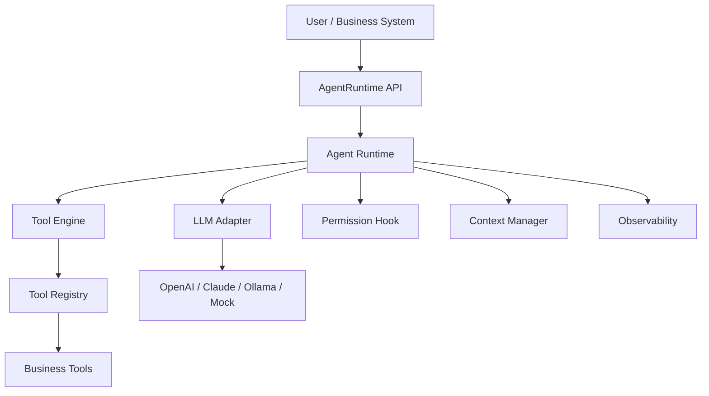
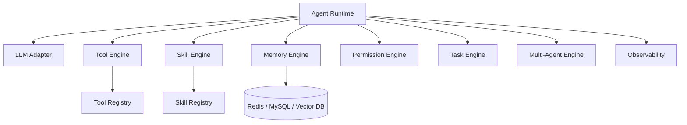

# OpenHarness4j 产品文档（MVP v0.1）

## 一、项目背景

随着大模型（LLM）的发展，AI 正在从“对话工具”演进为“执行工具”。传统 AI 应用通常只能回答问题，缺少调用系统能力、持续执行任务、接入业务工具和沉淀上下文的统一运行时。

当前常见问题：

* AI 只能生成文本，不能稳定调用数据库、API、文件、Shell 等系统能力。
* 不同业务重复实现 Agent Loop、Tool 调用、权限控制和日志追踪。
* 模型供应商接口差异较大，应用层直接耦合 OpenAI、Claude、Ollama 等模型协议。
* 工具执行缺少统一的权限拦截、异常处理、调用链记录和可测试标准。
* 长期来看，需要支持 Memory、Skill、Multi-Agent、异步任务等能力，但第一版必须先建立可靠的执行内核。

核心问题：

> 如何让 AI 从“会说话”变成“可控地做事”？

解决方案：

引入 **Agent Harness（智能体运行时）**，让模型负责决策，让系统负责执行。

```text
模型负责决策
系统负责执行
运行时负责连接、控制和观测
```

---

## 二、文档定位与版本范围

### 2.1 文档定位

本文档是 OpenHarness4j 的产品需求文档和研发落地规格，面向 Java 后端研发、AI 应用开发者和后续维护者。

本文档需要回答：

* v0.1 要交付什么能力。
* v0.1 不交付什么能力。
* 运行时的最小公开接口是什么。
* Agent Loop 如何执行、如何中断、如何处理异常。
* 如何判断 MVP 完成并可验收。

### 2.2 版本主线

MVP v0.1 的主线是：

> 构建一个最小可用 Java Agent Runtime，让业务系统可以注册工具、接入 LLM、发起 Agent 请求，并让模型在受控权限下调用工具完成任务。

### 2.3 v0.1 交付范围

| 模块 | v0.1 是否交付 | 说明 |
| --- | --- | --- |
| Agent Loop | 是 | 支持模型响应、工具调用、结果回写和循环终止 |
| LLM Adapter | 是 | 定义统一接口，至少支持一个可运行实现或 mock 实现 |
| Tool System | 是 | 支持工具定义、注册、查找、执行和结果返回 |
| Permission Hook | 是 | 在工具执行前提供权限拦截点 |
| 会话上下文 | 是 | 支持单次请求内消息上下文和 sessionId 传递 |
| 基础可观测 | 是 | 记录 traceId、工具调用链、耗时、token usage |
| Memory | 否 | v0.1 只保留接口预留，不实现长期记忆 |
| Skill | 否 | v0.1 不实现 Prompt + Workflow 技能编排 |
| Multi-Agent | 否 | v0.1 不实现多智能体协作 |
| Task Engine | 否 | v0.1 不实现异步任务、定时任务和任务恢复 |
| 插件市场 | 否 | v0.1 不实现插件包发布、安装和版本管理 |

### 2.4 v0.1 非目标

v0.1 明确不做：

* 不提供生产级权限审批流，只提供执行前权限判断接口。
* 不提供长期记忆、向量检索、用户画像沉淀。
* 不提供多 Agent 编排、任务拆解、子 Agent 调度。
* 不提供异步任务持久化、任务暂停恢复、分布式调度。
* 不提供前端控制台、插件市场、可视化编排器。
* 不承诺兼容所有 LLM 的高级特性，只抽象最小 chat + tool call 能力。

---

## 三、产品目标与用户场景

### 3.1 产品目标

OpenHarness4j 的长期目标是成为通用 Java Agent 内核，可嵌入任意业务系统，不绑定具体行业，并支持多模型、工具、技能、记忆、权限、任务和多智能体扩展。

MVP v0.1 的目标更聚焦：

* 让 Java 应用可以用统一接口运行一个 Agent。
* 让模型可以基于工具定义发起 tool call。
* 让业务代码可以注册 Java Tool，并拿到结构化执行上下文。
* 让工具执行前经过权限判断。
* 让每次运行可追踪、可测试、可复现关键路径。

### 3.2 目标用户

| 用户 | 诉求 | v0.1 提供的价值 |
| --- | --- | --- |
| Java 后端研发 | 在现有系统中接入 AI 执行能力 | 通过 AgentRuntime 和 ToolRegistry 嵌入 |
| AI 应用开发者 | 快速构建可调用工具的 Agent | 复用 Agent Loop、LLM Adapter、Tool System |
| 企业内部工具平台 | 让 AI 安全调用内部 API | 统一权限拦截、traceId 和调用日志 |
| 框架贡献者 | 扩展模型、工具、记忆、技能模块 | 清晰的接口边界和后续路线图 |

### 3.3 核心场景

场景一：工具调用型助手

* 用户输入：“查询订单 10001 的物流状态。”
* LLM 判断需要调用 `query_order` 工具。
* Runtime 检查权限、执行工具、把结果写回上下文。
* LLM 基于工具结果生成最终回答。

场景二：业务自动化 Agent

* 用户输入：“帮我统计今天失败的支付订单，并给出原因分类。”
* LLM 调用订单查询工具和统计工具。
* Runtime 记录每次工具调用、耗时和 traceId。
* 最终返回结构化分析结果。

场景三：可嵌入式 AI 执行内核

* 业务系统将 OpenHarness4j 作为 library 引入。
* 系统注册自定义工具和权限策略。
* 业务入口只调用 `AgentRuntime.run(request)`。

---

## 四、整体架构

### 4.1 MVP v0.1 架构图



### 4.2 长期架构预留



长期能力仍然保留在产品方向中，但 v0.1 的研发优先级必须围绕最小 Agent Runtime，不提前实现大而全的编排系统。

---

## 五、MVP 功能需求

### 5.1 Agent Runtime

作用：驱动整个 AI 执行流程。

核心流程：

```text
用户输入 -> 构建上下文 -> 调用 LLM -> 判断是否需要工具
-> 权限检查 -> 工具执行 -> 结果写回上下文 -> 继续 LLM
-> 返回最终响应
```

功能要求：

| 编号 | 需求 | 验收标准 |
| --- | --- | --- |
| AR-01 | 对外提供 `AgentRuntime.run(AgentRequest request)` | 调用后返回 `AgentResponse` |
| AR-02 | 支持普通文本响应 | LLM 不返回 tool call 时直接结束 |
| AR-03 | 支持单工具调用 | 能执行一个工具并把结果写回 messages |
| AR-04 | 支持多工具调用 | 按 LLM 返回顺序串行执行多个工具 |
| AR-05 | 支持最大循环次数 | 默认 8 次，超过返回 `MAX_ITERATION_EXCEEDED` |
| AR-06 | 支持 traceId | 每次 run 都能生成或透传 traceId |

### 5.2 LLM Adapter

作用：屏蔽不同模型供应商差异，向 Runtime 暴露统一 chat 接口。

功能要求：

| 编号 | 需求 | 验收标准 |
| --- | --- | --- |
| LLM-01 | 定义统一 `LLMAdapter` 接口 | Runtime 不直接依赖具体供应商 SDK |
| LLM-02 | 支持 messages 输入 | 能传入 system、user、assistant、tool 消息 |
| LLM-03 | 支持工具定义输入 | 能把 `ToolDefinition` 转给模型 |
| LLM-04 | 支持 tool call 输出 | 能解析模型返回的工具名和参数 |
| LLM-05 | 支持 usage 输出 | 返回 prompt tokens、completion tokens、total tokens |
| LLM-06 | 支持 mock 实现 | 单元测试无需真实调用外部模型 |

### 5.3 Tool System

作用：给 AI 可执行的“手”。

v0.1 内置能力不是重点，重点是稳定的工具扩展接口。业务方可以注册自己的工具，例如文件读取、数据库查询、HTTP API、订单查询、报表统计等。

功能要求：

| 编号 | 需求 | 验收标准 |
| --- | --- | --- |
| TOOL-01 | 定义 `Tool` 接口 | 工具能声明名称、描述、参数 schema 和执行逻辑 |
| TOOL-02 | 提供 `ToolRegistry` | 支持注册、查找、列出工具 |
| TOOL-03 | 工具名称唯一 | 重名注册应失败或覆盖策略明确 |
| TOOL-04 | 工具执行入参结构化 | `ToolContext` 包含 args、sessionId、userId、traceId、metadata |
| TOOL-05 | 工具结果结构化 | `ToolResult` 区分 success、failed、permission denied |
| TOOL-06 | 工具结果可回写 LLM | `ToolResult` 能转换为 tool message |

### 5.4 Permission Hook

作用：防止 AI 做危险操作，给业务系统保留安全控制点。

功能要求：

| 编号 | 需求 | 验收标准 |
| --- | --- | --- |
| PERM-01 | 工具执行前必须调用权限判断 | 每个 tool call 在执行前触发 `PermissionChecker.allow` |
| PERM-02 | 权限结果结构化 | 返回 allow、deny reason、risk level |
| PERM-03 | 拒绝后不中断整个进程 | 权限拒绝转换为 tool result 写回上下文 |
| PERM-04 | 默认安全策略 | 未配置时默认允许普通工具，危险工具由业务显式控制 |

v0.1 不实现审批流，只提供 hook。

### 5.5 Context Manager

作用：维护单次 Agent 执行中的消息上下文和请求元数据。

功能要求：

| 编号 | 需求 | 验收标准 |
| --- | --- | --- |
| CTX-01 | 初始化 user message | `AgentRequest.input` 被转换为 user message |
| CTX-02 | 写入 assistant message | LLM 响应能进入上下文 |
| CTX-03 | 写入 tool message | 工具结果能进入上下文 |
| CTX-04 | 传递 sessionId 和 userId | 工具执行时可读取请求身份信息 |
| CTX-05 | 保留 metadata | 业务自定义元数据能透传到工具 |

v0.1 的上下文只保证单次 `run` 内有效，不实现跨请求长期记忆。

### 5.6 Observability

作用：让每次 Agent 执行可追踪、可排查、可统计。

功能要求：

| 编号 | 需求 | 验收标准 |
| --- | --- | --- |
| OBS-01 | 生成 traceId | 每次 run 都有唯一 traceId |
| OBS-02 | 记录工具调用链 | 工具名、参数摘要、状态、耗时可记录 |
| OBS-03 | 记录 token usage | 汇总每轮 LLM usage |
| OBS-04 | 记录 finishReason | 明确 stop、error、permission denied、max iteration 等结束原因 |
| OBS-05 | 日志不泄露敏感值 | 参数日志默认只记录摘要，原始值由业务显式开启 |

---

## 六、核心接口与类型约定

### 6.1 AgentRuntime

```java
public interface AgentRuntime {

    AgentResponse run(AgentRequest request);
}
```

职责：

* 接收业务请求。
* 构建执行上下文。
* 调用 LLM。
* 执行工具调用。
* 汇总最终响应和观测信息。

### 6.2 AgentRequest

```java
public record AgentRequest(
        String sessionId,
        String userId,
        String input,
        Map<String, Object> metadata
) {
}
```

字段约定：

| 字段 | 必填 | 说明 |
| --- | --- | --- |
| sessionId | 是 | 会话 ID，用于本次执行链路标识和后续 Memory 预留 |
| userId | 是 | 用户 ID，用于权限判断和业务审计 |
| input | 是 | 用户输入 |
| metadata | 否 | 业务自定义信息，如租户、角色、渠道、请求来源 |

### 6.3 AgentResponse

```java
public record AgentResponse(
        String content,
        List<ToolCallRecord> toolCalls,
        Usage usage,
        String traceId,
        FinishReason finishReason
) {
}
```

字段约定：

| 字段 | 说明 |
| --- | --- |
| content | 返回给调用方的最终文本 |
| toolCalls | 本次执行发生过的工具调用记录 |
| usage | token 用量汇总 |
| traceId | 链路追踪 ID |
| finishReason | 执行结束原因 |

```java
public enum FinishReason {
    STOP,
    ERROR,
    PERMISSION_DENIED,
    TOOL_NOT_FOUND,
    MAX_ITERATION_EXCEEDED
}
```

### 6.4 LLMAdapter

```java
public interface LLMAdapter {

    LLMResponse chat(List<Message> messages, List<ToolDefinition> tools);
}
```

返回约定：

```java
public record LLMResponse(
        Message message,
        List<ToolCall> toolCalls,
        Usage usage
) {
    public boolean hasToolCalls() {
        return toolCalls != null && !toolCalls.isEmpty();
    }
}
```

要求：

* `message` 表示模型本轮 assistant 消息。
* `toolCalls` 为空时，Runtime 结束并返回最终回答。
* `usage` 可以为空，但真实模型适配器应尽量提供。

### 6.5 Tool

```java
public interface Tool {

    String name();

    String description();

    ToolDefinition definition();

    ToolResult execute(ToolContext context);
}
```

`ToolDefinition` 用于告诉模型工具如何调用：

```java
public record ToolDefinition(
        String name,
        String description,
        Map<String, Object> parametersSchema
) {
}
```

### 6.6 ToolContext

```java
public record ToolContext(
        String sessionId,
        String userId,
        String traceId,
        String toolCallId,
        Map<String, Object> args,
        Map<String, Object> metadata
) {
}
```

字段约定：

| 字段 | 说明 |
| --- | --- |
| sessionId | 来自 `AgentRequest` |
| userId | 来自 `AgentRequest` |
| traceId | 本次 run 的链路 ID |
| toolCallId | 模型返回的工具调用 ID |
| args | 模型生成的工具参数 |
| metadata | 业务自定义上下文 |

### 6.7 ToolResult

```java
public record ToolResult(
        ToolResultStatus status,
        String content,
        Map<String, Object> data,
        String errorCode,
        String errorMessage
) {
}
```

```java
public enum ToolResultStatus {
    SUCCESS,
    FAILED,
    PERMISSION_DENIED
}
```

要求：

* 成功时 `status = SUCCESS`，`content` 描述可给模型读取的结果。
* 失败时 `status = FAILED`，需要提供 `errorCode` 和 `errorMessage`。
* 权限拒绝时 `status = PERMISSION_DENIED`，拒绝原因写入 `content` 或 `errorMessage`。
* `ToolResult` 必须能转换为 LLM 可继续消费的 tool message。

### 6.8 ToolRegistry

```java
public interface ToolRegistry {

    void register(Tool tool);

    Optional<Tool> get(String name);

    List<ToolDefinition> definitions();
}
```

约定：

* 工具名称必须唯一。
* `definitions()` 返回所有已注册工具的模型可见定义。
* v0.1 不要求运行时动态卸载工具。

### 6.9 PermissionChecker

```java
public interface PermissionChecker {

    PermissionDecision allow(ToolCall call, AgentContext context);
}
```

```java
public record PermissionDecision(
        boolean allowed,
        String reason,
        RiskLevel riskLevel
) {
}
```

```java
public enum RiskLevel {
    LOW,
    MEDIUM,
    HIGH
}
```

约定：

* `allowed = true` 时继续执行工具。
* `allowed = false` 时不执行工具，并生成权限拒绝的 `ToolResult`。
* v0.1 的权限判断同步完成。

---

## 七、Agent Loop 执行流程

### 7.1 核心循环伪代码

```java
int maxIterations = 8;
List<Message> messages = contextManager.init(request);

for (int i = 0; i < maxIterations; i++) {
    LLMResponse llmResponse = llmAdapter.chat(messages, toolRegistry.definitions());
    messages.add(llmResponse.message());

    if (!llmResponse.hasToolCalls()) {
        return AgentResponse.stop(llmResponse.message(), trace);
    }

    for (ToolCall call : llmResponse.toolCalls()) {
        PermissionDecision decision = permissionChecker.allow(call, agentContext);

        if (!decision.allowed()) {
            ToolResult denied = ToolResult.permissionDenied(decision.reason());
            messages.add(denied.toMessage(call.id()));
            trace.recordDenied(call, decision);
            continue;
        }

        Optional<Tool> tool = toolRegistry.get(call.name());
        if (tool.isEmpty()) {
            ToolResult missing = ToolResult.failed("TOOL_NOT_FOUND", call.name());
            messages.add(missing.toMessage(call.id()));
            trace.recordFailed(call, missing);
            continue;
        }

        ToolResult result = tool.get().execute(toToolContext(call, request, trace));
        messages.add(result.toMessage(call.id()));
        trace.recordToolResult(call, result);
    }
}

return AgentResponse.maxIterationExceeded(trace);
```

### 7.2 执行场景

| 场景 | Runtime 行为 | finishReason |
| --- | --- | --- |
| 模型返回普通文本 | 直接返回文本 | `STOP` |
| 模型返回单个工具调用 | 权限检查、执行工具、结果回写、继续下一轮 LLM | 最终通常为 `STOP` |
| 模型返回多个工具调用 | 按返回顺序串行执行，每个结果都写回上下文 | 最终通常为 `STOP` |
| 工具不存在 | 生成失败 tool message，允许模型基于错误继续处理 | 若最终无法恢复则 `TOOL_NOT_FOUND` 或 `ERROR` |
| 权限拒绝 | 生成权限拒绝 tool message，允许模型解释无法执行 | `PERMISSION_DENIED` 或最终 `STOP` |
| 工具执行失败 | 捕获异常并转为失败 tool message | `ERROR` 或最终 `STOP` |
| 超过循环次数 | 停止执行并返回保护性错误 | `MAX_ITERATION_EXCEEDED` |

### 7.3 循环次数

默认最大循环次数为 8。该限制用于避免模型反复调用工具导致死循环、费用失控或业务系统压力过大。

配置建议：

```yaml
openharness:
  agent:
    max-iterations: 8
```

---

## 八、异常处理与失败模式

| 失败模式 | 触发条件 | v0.1 处理方式 |
| --- | --- | --- |
| LLM 返回空响应 | message 和 toolCalls 都为空 | 返回 `ERROR`，记录 traceId |
| LLM 调用失败 | API 超时、鉴权失败、网络失败 | 返回 `ERROR`，保留错误摘要 |
| 工具不存在 | `ToolRegistry` 找不到工具名 | 写入失败 tool message |
| 工具参数非法 | args 缺字段或类型不匹配 | 工具返回 `FAILED`，错误码 `INVALID_ARGS` |
| 权限拒绝 | `PermissionChecker` 返回 denied | 不执行工具，写入权限拒绝 tool message |
| 工具抛异常 | Java Tool 执行时异常 | Runtime 捕获并转为 `ToolResult.failed` |
| 循环超限 | 达到 max iterations | 返回 `MAX_ITERATION_EXCEEDED` |
| usage 缺失 | 模型供应商不返回 token | usage 字段允许为空或为 0 |

日志要求：

* 所有失败都必须包含 traceId。
* 默认不记录完整敏感参数。
* 异常栈可写入 debug 日志，不直接暴露给最终用户。

---

## 九、技术选型与项目结构

### 9.1 技术选型

| 项目 | v0.1 选择 |
| --- | --- |
| JDK | 17 |
| 框架 | Spring Boot 3 作为 starter 集成方向，核心 runtime 不强依赖 Web |
| 构建 | Maven 或 Gradle，优先保持单一构建工具 |
| LLM 接入 | OpenAI / Claude / Ollama / Mock 通过 `LLMAdapter` 扩展 |
| 日志 | SLF4J |
| JSON | Jackson |
| 测试 | JUnit 5 + Mockito 或同等 mock 工具 |
| 缓存 / DB / Vector DB | v0.1 不强制引入，后续 Memory 模块使用 |

### 9.2 建议项目结构

```text
openharness4j/
├── agent-runtime/
├── llm-adapter/
├── tool-engine/
├── permission-engine/
├── observability/
├── starter/
└── examples/
```

后续模块预留：

```text
openharness4j/
├── memory-engine/
├── skill-engine/
├── task-engine/
├── multi-agent/
└── plugins/
```

---

## 十、开发里程碑

### 10.1 v0.1-alpha

目标：跑通最小 Agent Loop。

交付内容：

* `AgentRuntime.run`。
* `LLMAdapter` mock 实现。
* `Tool`、`ToolRegistry`、`ToolResult`。
* 单工具调用执行链路。
* 基础单元测试。

验收：

* 注册一个 mock tool 后，mock LLM 返回 tool call，Runtime 能执行工具并把结果写回上下文。

### 10.2 v0.1-beta

目标：补齐 MVP 的稳定性和安全控制点。

交付内容：

* 多工具调用串行执行。
* `PermissionChecker` 和 `PermissionDecision`。
* traceId、工具调用记录、usage 汇总。
* 工具不存在、权限拒绝、工具异常、LLM 空响应处理。

验收：

* 所有失败模式都有确定响应。
* 权限拒绝不会执行工具。
* 每次运行都能通过 traceId 追踪工具调用链。

### 10.3 v0.1-release

目标：达到可嵌入业务系统的最小可用状态。

交付内容：

* 至少一个真实 LLM Adapter 或清晰的适配示例。
* Spring Boot Starter 或最小集成示例。
* 示例工具和完整 README。
* 完整测试覆盖和文档验收。

验收：

* 外部 Java 项目可以引入 OpenHarness4j，注册工具，调用 `AgentRuntime.run` 并获得最终回答。

---

## 十一、验收标准与测试计划

### 11.1 产品验收标准

| 能力 | 验收标准 |
| --- | --- |
| Agent Runtime | 能处理普通文本响应和 tool call 响应 |
| Tool System | 能注册、查找、执行工具，并返回结构化结果 |
| Permission Hook | 每个工具执行前都经过权限判断 |
| Context | 用户输入、模型响应、工具结果按顺序进入上下文 |
| Observability | 响应中包含 traceId、finishReason、usage、toolCalls |
| Loop Guard | 超过 8 次循环后停止并返回 `MAX_ITERATION_EXCEEDED` |
| Error Handling | 常见失败模式不导致 Runtime 崩溃 |

### 11.2 单元测试

* Tool 注册成功、重复注册策略、查找不存在工具。
* Permission 允许和拒绝两种路径。
* ToolResult 成功、失败、权限拒绝到 message 的转换。
* Agent Loop 在无 tool call 时直接返回。
* Agent Loop 达到最大循环次数后终止。

### 11.3 集成测试

* 使用 mock LLM 返回单个 tool call，验证工具被执行一次。
* 使用 mock LLM 返回多个 tool call，验证按顺序串行执行。
* 使用 mock LLM 在工具结果后返回最终文本，验证完整闭环。
* 使用 mock PermissionChecker 拒绝工具，验证工具不会执行。

### 11.4 异常测试

* 工具不存在。
* 工具参数非法。
* 工具执行抛异常。
* LLM 返回空响应。
* LLM 调用超时或异常。
* usage 缺失。

### 11.5 文档验收

只阅读本文档，研发应能明确：

* v0.1 要做什么。
* v0.1 不做什么。
* 核心接口长什么样。
* Agent Loop 如何执行。
* 失败场景如何处理。
* 如何写测试判断功能完成。

---

## 十二、长期路线图

### v0.2：Memory

* 支持跨请求会话记忆。
* 提供 InMemory 和 Redis / MySQL 存储实现。
* 支持上下文窗口裁剪和摘要。

### v0.3：Skill

* 支持 Prompt + Workflow 的技能定义。
* 支持 YAML 或 Java DSL 注册技能。
* 支持技能调用工具完成固定流程。

### v0.4：Task Engine

* 支持长任务、异步任务和任务状态查询。
* 支持任务取消和超时控制。

### v0.5：Multi-Agent

* 支持主 Agent 拆解任务。
* 支持子 Agent 执行独立职责。
* 支持结果汇总和冲突处理。

### v1.0：生产可用 Agent Runtime

* 完整权限策略和审计。
* 稳定插件机制。
* 多模型适配。
* 完整可观测能力。
* 企业级文档、示例和兼容性承诺。

---

## 十三、风险与约束

| 风险 | 说明 | 应对 |
| --- | --- | --- |
| LLM tool call 协议差异 | 不同模型返回结构不一致 | 用 `LLMAdapter` 屏蔽差异 |
| 工具执行安全风险 | AI 可能调用高危工具 | v0.1 强制 Permission Hook |
| 循环失控 | 模型可能反复调用工具 | 默认最大循环次数 8 |
| 日志泄露敏感信息 | 工具参数可能包含业务数据 | 默认只记录摘要 |
| 范围膨胀 | 长期能力很多，容易拖慢 MVP | v0.1 只做最小 Runtime |

---

## 十四、总结

OpenHarness4j 的长期定位是 Java 版通用 Agent Harness。它不是一个单一业务应用，而是一个可嵌入、可扩展、可观测、可控制的 AI 执行内核。

v0.1 的本质是：

```text
最小可用 AI 执行引擎 = Agent Loop + LLM Adapter + Tool System + Permission Hook + Observability
```

完成 v0.1 后，业务系统应能够用统一方式注册工具、运行 Agent、控制权限、追踪调用链，并在此基础上继续扩展 Memory、Skill、Task 和 Multi-Agent。
